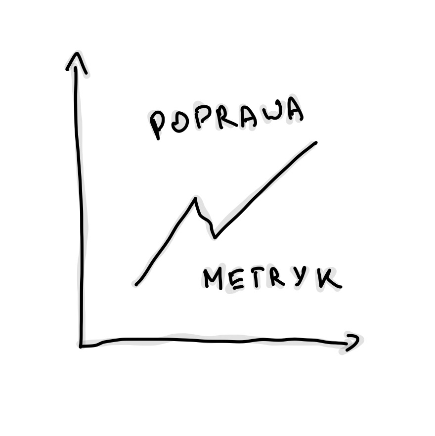
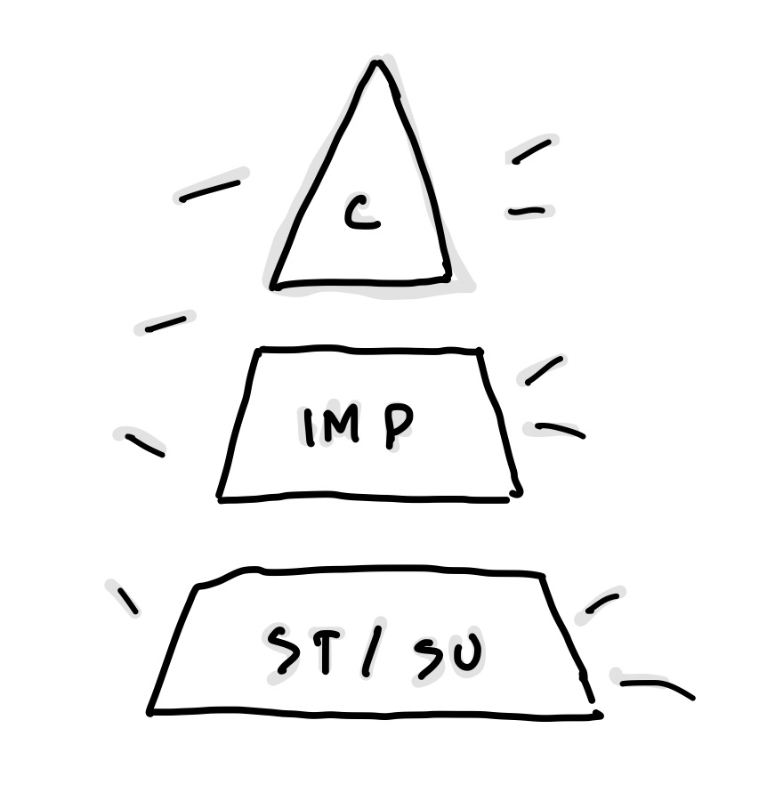
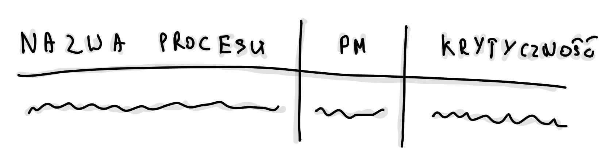
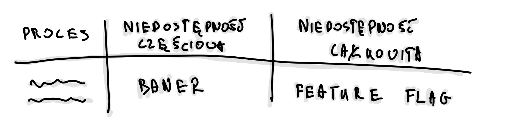
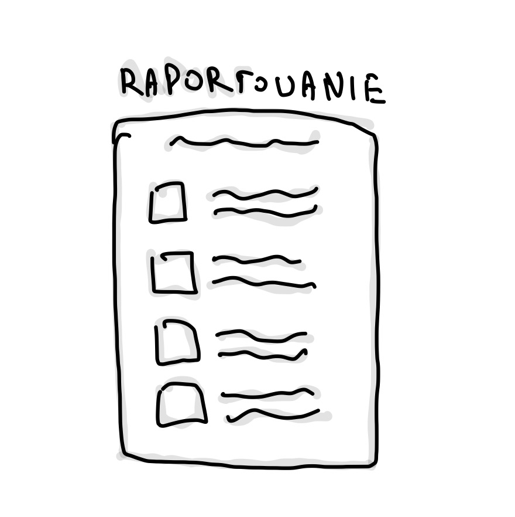
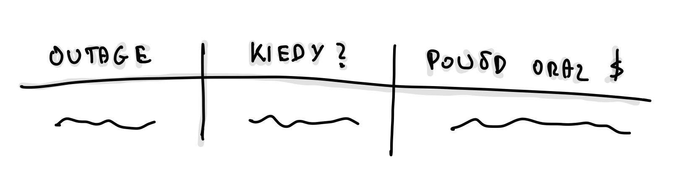

Pracując jako inżynier w dużej organizacji, miałem do czynienia zarówno z metrykami biznesowymi, jak i technicznymi. Monitorowaliśmy procesy biznesowe, takie jak przykładowo liczba zakończonych płatności, czy wypełnione formularze, za pomocą [Victoria Metrics](https://victoriametrics.com/) i dashboardów w [Grafanie](https://grafana.com/). Mimo że te dane były dostępne, brakowało nam zrozumienia, co dokładnie się stanie, gdy osiągniemy krytyczne progi – jakie będą rzeczywiste konsekwencje dla produktu? Równocześnie skupiałem się na technicznych wskaźnikach, takich jak stosunek nieudanych zapytań do udanych, co sprawiało, że traciliśmy z oczu pełen obraz wpływu tych metryk na funkcjonowanie biznesu.

Prawdziwy przełom nastąpił, gdy rozpocząłem współpracę z jednym z bardziej doświadczonych inżynierów w firmie nad SLO. Zauważył, że metryki techniczne, na których opieraliśmy naszą codzienną pracę, nie zawsze odzwierciedlały to, co rzeczywiście jest ważne dla produktu. Razem doszliśmy do wniosku, że nadszedł czas, aby spojrzeć na metryki z innej perspektywy – z punktu widzenia biznesu.

## Co tak naprawdę optymalizujemy?

Kiedy podjęliśmy się tego wyzwania, miałem w głowie dwie kluczowe perspektywy (kolejność przypadkowa):

1. **Dobrostan inżynierów** – Zbierając feedback od kolegów z zespołu, którzy pełnili dyżury, zauważyłem, że choć technicznie uzasadnione alerty, nie zawsze wymagały natychmiastowej interwencji. Zdażało się, że inżynierowie spędzali nieprzespane noce na rozwiązywaniu problemów, które mogły poczekać do rana. Zacząłem się zastanawiać – czy wszystkie te alarmy są naprawdę konieczne? Czy możemy znaleźć sposób, aby lepiej tym zarządzać?

2. **Koszty i efektywność biznesu** – Zrozumienie, kiedy interwencja jest naprawdę potrzebna, a kiedy można poczekać, jest kluczowe nie tylko dla dobrostanu zespołu, ale również dla wyników finansowych produktu. Nasze procesy często ulegają zmianom z uwagi na etap, w którym jest projekt, zwłaszcza w kontekście kampanii marketingowych, co sprawia, że trudno jest ustalić stałe progi do interwencji. Moim celem stało się znalezienie odpowiedzi na dwa kluczowe pytania:

    - Jak duży spadek konwersji powinien wywołać natychmiastową reakcję dyżurnego? Wspólnie z zespołem ustaliliśmy, że musimy uwzględnić różnice między dniami roboczymi a weekendami, a także święta. Opcjonalnie braliśmy pod uwagę wpływ kampanii marketingowych.

    - Kiedy powinniśmy wezwać dyżurnego do awarii, a kiedy dodatkowo rozważyć czasowe wyłączenie usługi? Musieliśmy uwzględnić krytyczność procesu na podstawie kluczowych wskaźników (KPI), z których rozliczani są menedżerowie produktów. Ważne było także zrozumienie, jak efektywnie potrafimy obsługiwać problemy – czy lepiej wydłużyć proces, czy całkowicie przerwać go i kazać zacząć od nowa? Zastanawialiśmy się także, czy klienci wrócą, jeśli przerwiemy im proces w połowie, lub jeśli zablokujemy im dostęp.

Aby odpowiedzieć na te pytania, zorganizowaliśmy serię warsztatów z zespołem biznesowym. To pozwoliło nam lepiej zrozumieć oczekiwania i ograniczenia, które musimy brać pod uwagę.

## Inicjatywy

Zrozumienie tych dwóch perspektyw – dobrostanu inżynierów oraz kosztów – pomogło nam wyznaczyć kierunki działania. Wspólnie opracowaliśmy plan, który podzieliliśmy na kilka etapów:

1. **Przegląd miar (metryk i alertowania)** – Postanowiliśmy, że naszym priorytetem będzie jak najszybsze przestawienie się na metryki biznesowe. To, że system wykrywa błąd techniczny, nie zawsze oznacza, że klient napotkał problem. Podzieliliśmy metryki na biznesowe i techniczne, a także przeanalizowaliśmy, które z nich można wyciszyć, aby uniknąć niepotrzebnych alarmów. Ważne było również zrozumienie, co w kontekście prawa oznacza „dokonać wszelkich starań”, na przykład, czy brak dostarczenia maila z umową w niedzielę jest naruszeniem regulacji.

2. **Wyznaczenie krytyczności komponentów (component criticality)** – Projekt urósł do rozmiarów, w których nie mogliśmy już traktować wszystkich procesów biznesowych jednakowo. Musieliśmy podzielić je na kategorie według ich krytyczności, aby zapewnić odpowiednią jakość działania. Skategoryzowaliśmy metryki według ich ważności – od krytycznych po wspierające, i dostosowaliśmy je do różnych dni tygodnia i godzin pracy.

3. **Zarządzanie niedostępnością (handling unavailability)** – Przygotowaliśmy polityki eskalacyjne dla większości zewnętrznych partnerów, a także procedury działania w ramach incydentów. Naszym celem było również stworzenie jednego, przejrzystego widoku, który pozwalałby monitorować najważniejsze wskaźniki na jednym ekranie. Przepracowaliśmy definicje awarii i niedostępności, aby lepiej zrozumieć, co naprawdę wpływa na użytkowników i biznes.

4. **Tworzenie raportu SLA** – Wybraliśmy kluczowe procesy, które miały największy wpływ na wyniki produktu, i przypisaliśmy im metryki. Wprowadzenie narzędzi do centralizowanego raportowania incydentów pozwoliło nam lepiej śledzić przyczyny problemów i określać, kiedy spadki SLA były wynikiem naszych błędów, a kiedy były winą dostawców. Dzięki temu możemy podejmować bardziej świadome decyzje dotyczące dalszej współpracy z dostawcami oraz optymalizować umowy.

Przejdźmy teraz przez poszczególne inicjatywy.

## 1. Przegląd miar - SLI

W naszym systemie mieliśmy już wiele różnych metryk i alertów. Niektóre z nich były absolutnie uzasadnione, inne jednak okazywały się mniej istotne. Wprowadzenie zmian i rezygnacja z części metryk stanowiło wyzwanie, ponieważ część z nich była wymagana przez organizację, a inne były po prostu przyzwyczajeniem inżynierów. Aby móc zrezygnować z niektórych, musieliśmy wykazać, że potrafimy je zastąpić bardziej efektywnymi wskaźnikami.

<!-- markdownlint-disable -->

<!-- markdownlint-restore -->

Rozpoczynając porządkowanie metryk, podzieliliśmy je na dwie główne kategorie:

**Business Metrics**

-   **Process**: onboarding, płatność, operacje itp.

-   **Kind**: Typ metryki, np. niski poziom (low), problem, awaria (failure), spadek (drop) itp.

Naszym celem było skoncentrowanie się na metrykach jak konwersja czy spadek wartości poniżej określonego progu. Wprowadziliśmy kategoryzację metryk na poziomie procesów. Dodatkowo, zaczęliśmy eksperymentować z różnymi metodami, takimi jak [odchylenia standardowe](https://pl.wikipedia.org/wiki/Odchylenie_standardowe), [współczynnik z-score (standard)](https://en.wikipedia.org/wiki/Standard_score) oraz [analiza sezonowości](https://pl.wikipedia.org/wiki/Wahania_sezonowe). W sensownych oknach czasowych, odpowiednio dostosowanych do specyfiki procesów, tworzyliśmy metryki konwersji na podstawie ruchu. Ruch ten – poza kampaniami marketingowymi – jest dość przewidywalny, a my wiedzieliśmy, że w ciągu dnia nigdy nie spada poniżej określonego minimum

**Technical Metrics**

-   **Type**: zapytania, zasoby (compute, bazy itd), partnerzy/dostawcy, logi, platforma, metryki customowe itp.

-   **Kind**: Rodzaj problemu, np. błąd (error), degradacja (degraded), zbyt duża liczba (too many), brak dostępności (downtime), niski poziom (low) itp.

Te metryki były związane między innymi z degradacją naszej infrastruktury, np. spadkiem wydajności CosmosDB, Service Bus, SQL Servera itp. Obejmowały także restarty serwisów związane z OOM, niedostępnością usług zewnętrznych, czy rosnącą liczbą krytycznych logów. Choć te metryki są bardzo wartościowe, pojawia się pytanie, czy zawsze wpływają na nasz biznes na tyle, by wymagały natychmiastowej interwencji? Część procesów jest asynchroniczna i często sama naprawia się po kilku ponowieniach.

Przykładowe nazwy metryk według tej konwencji to:

-   `business_onboarding_low`

-   `business_payment_method_not_available`

-   `business_payment_drop`

-   `technical_request_api_stability_low`

-   `technical_resource_cosmos_performance_degraded`

-   `technical_k8s_oom_high`

Jedną z takich technicznych metryk było API stability, które nie mogło spaść poniżej 99,9%. W przypadku nowego produktu, z relatywnie niskim ruchem, zwłaszcza w nocy, mogło to prowadzić do niepotrzebnego alarmowania. Dochodziło do sytuacji, w których już 15 nieudanych zapytań na 15 000 uruchamiało alarm. Problem tkwił w tym, że system badał wszystkie zapytania, zamiast uwzględniać tylko unique users. Taka metryka ma sens jako wsparcie, ale tylko przy dużym ruchu. Dodatkowo, monitorowanie oparte było na 24-godzinnych oknach, co sprawiało, że endpointy, które były rzadko używane, mogły generować alerty przez długi czas, zanim wskaźniki wróciły do normy. Często były to błędy przejściowe (transient), timeouty itp., które nie mogły być naprawione podczas dyżuru.

Mieliśmy trzy możliwości:

1. Poluzowanie samej metryki, np. poprzez zmianę progu procentowego lub skrócenie okna czasowego z 24h na 1h.

2. Ustawienie niższego progu, np. wykluczającego godziny nocne.

3. Całkowite przejście na metryki biznesowe, które odzwierciedlają rzeczywiste problemy użytkowników.

Wybraliśmy opcję skrócenia okna do 1h oraz ustawienie minimalnego progu, co pozwoliło nam zachować wysoką niezawodność usług w godzinach szczytu, jednocześnie redukując zbędne alerty w okresach niskiego ruchu. W miarę doskonalenia naszej strategii alertowania, rozważymy całkowite wyciszenie tej metryki, jeśli okaże się, że wszystkie krytyczne przypadki biznesowe są odpowiednio uwzględnione, a nasze obecne podejście przynosi oczekiwane rezultaty.

## 2. Wyznaczenie krytyczności procesów

Bez wyznaczenia krytyczność dalsze kroki, takie jak obsługa niedostępności, tracą sens. Obserwując, jak inne firmy radzą sobie z tym, postanowiliśmy pójść ich śladem i wprowadziliśmy cztery poziomy krytyczności procesów.

**Jak klasyfikujemy procesy?**

Procesy zostały podzielone na cztery poziomy krytyczności:

1. **Krytyczny (Critical)**: Procesy niezbędne do funkcjonowania produktu i ochrony jego reputacji. Wymagają szybkiej reakcji i przywrócenia działania w ciągu kilku godzin (najczęściej 1-2 godziny), zarówno w dni robocze, jak i weekendy.

2. **Ważny (Important)**: Procesy, które mają umiarkowany wpływ na interakcje z klientami oraz wewnętrzne operacje.
    <!-- markdownlint-disable -->

    

    <!-- markdownlint-restore -->

    Wymagają naprawy w ciągu kilku godzin (zwykle 3-6 godzin), zarówno w dni robocze, jak i weekendy, ale czas reakcji może być bardziej elastyczny niż w przypadku procesów krytycznych.

3. **Standardowy (Standard)**: Procesy o mniejszym wpływie na klientów, gdzie opóźnienia w przywróceniu działania są akceptowalne i mogą potrwać kilka dni. Naprawa takich procesów odbywa się wyłącznie w dni robocze, w godzinach pracy. Przykłady to systemy do wewnętrznego raportowania.

4. **Wspierający (Supporting)**: Procesy o minimalnym wpływie na działanie produktu. Nie wymagają natychmiastowej reakcji i mogą być naprawiane w dni robocze, w standardowych godzinach pracy. Obejmuje to np. systemy archiwizacji danych.

Po ustaleniu tych poziomów przyszedł czas na praktyczne zastosowanie. W naszym projekcie, co może być nietypowe, mieliśmy trzech Product Managerów (PM-ów). Celem było zrozumienie, który z nich odpowiada za dany proces – nie w sensie wykonawstwa, ale odpowiedzialności za kluczowe wskaźniki (KPI). Stworzyliśmy więc tabelę, która miała pomóc nam w przypisaniu odpowiednich poziomów krytyczności.

Tabela składała się z:

-   **Nazwa procesu** – na przykład "Onboarding - wypełnienie formularza" czy "Płatność - wprowadzenie PIN i realizacja".

-   **PM** – osoba odpowiedzialna za proces. Ważne było, aby nie mylić osoby, która wdrażała proces, z osobą, która odpowiada za jego wyniki. Ktoś mógł być zaangażowany w implementację, ale to nie oznacza, że jest odpowiedzialny za osiąganie KPI.

-   **Krytyczność** – jedno z czterech poziomów opisanych powyżej. Aby wesprzeć decyzje, wielokrotnie musieliśmy powtarzać przykłady typu: "Czy warto odchodzić od stołu w Wigilię?", "Czy muszę wstać o 3 w nocy w niedzielę?" albo "Czy to może poczekać do poniedziałku?" Ostatecznie chodziło o ustalenie priorytetów: "Który proces naprawić najpierw?"

<!-- markdownlint-disable -->

 
<!-- markdownlint-restore -->

To ćwiczenie okazało się trudne, dlatego warto przeprowadzać je w dwie osoby. Ja miałem przyjemność pracować z [PSE](https://staffeng.com/guides/what-do-staff-engineers-actually-do/), który był stosunkowo daleko od samego produktu. Dzięki temu wnosił świeżą perspektywę.

Trzeba pamiętać również, że ustalone poziomy krytyczności nie są wyryte w kamieniu. To, co dziś jest priorytetem, może za kilka miesięcy stracić na znaczeniu. Kluczowe KPI mogą się zmieniać – na przykład na początku priorytetem jest masowe wpuszczanie użytkowników, a później dbanie o to, by faktycznie korzystali z usługi. Tabela ta to kontrakt między zespołem technicznym a biznesem. Dzięki niej możemy precyzyjnie ustalić, które alerty są krytyczne, a które mogą poczekać do poniedziałku. Jeśli coś ma status "standard" lub "wspierający", biznes bierze na siebie ryzyko, że ewentualne problemy zostaną rozwiązane później. Jeśli wyżej, biznes bierze na siebie koszt obsługi.

## 3. Obsługa niedostępności

<!-- markdownlint-disable -->

<!-- markdownlint-restore -->

Po wyznaczeniu krytyczności procesów, następnym krokiem było opracowanie przejrzystych instrukcji zarządzania niedostępnościami. Chodziło o stworzenie zestawu zasad, które umożliwią podejmowanie decyzji opartych na danych, zamiast intuicji czy subiektywnych odczuć techników. Takie podejście eliminuje niejasności i pomaga w skutecznym reagowaniu na problemy.

**Poziomy niedostępności**

Aby efektywnie zarządzać incydentami, wdrożyliśmy trzy poziomy niedostępności:

-   **Całkowita niedostępność (P1)**:

    -   **Kryteria**: Znaczący wpływ na system, przekraczający 25-50% ustalonego progu krytyczności. Dotknięte są kluczowe wskaźniki biznesowe, takie jak GMV, NPS lub KPI.

    -   **Działania**: Natychmiastowa interwencja (np. uruchomienie [kill switches](https://martinfowler.com/articles/feature-toggles.html)), z jednoczesnym wykonaniem procedur przypisanych do P2.

-   **Częściowa niedostępność (P2)**:

    -   **Kryteria**: Problem przekracza próg krytyczności dla ważnych operacji biznesowych.

    -   **Działania**: Analiza problemu, eskalacja, tworzenie zgłoszeń, wyświetlanie banerów informacyjnych, a następnie próba naprawy.

-   **Standardowe wsparcie (P3)**:

    -   **Kryteria**: Problemy P2 obsługiwane w dni robocze.

    -   **Działania**: Realizacja standardowych procedur.

Podobnie jak przy wyznaczaniu krytyczności procesów, współpracowaliśmy z zespołem biznesowym, aby ustalić, kiedy i jak należy reagować. W trakcie tych rozmów przydatne okazały się pytania takie jak: „Czy możemy pozwolić sobie na 20% utraconych transakcji? Nie uważasz, że to duża strata?” lub „Czyli chcesz powiedzieć, że wystarczy 40% zaafektowanych procesów i już powinniśmy wyłączać funkcjonalność?”. Często sugerowaliśmy też alternatywę dla wyłączania funkcji, jak na przykład wyświetlanie banerów informacyjnych.

<!-- markdownlint-disable -->

 
<!-- markdownlint-restore -->

**Optymalizacja wykrywania problemów**

Kolejnym kluczowym elementem było dostosowanie okien czasowych do wykrywania niedostępności, w zależności od natężenia ruchu. Przy dużym ruchu mogliśmy sobie pozwolić na krótsze okna czasowe (5-15 minut), co pozwalało na szybkie wykrywanie problemów. Jednak krótsze okna mogły także powodować fałszywe alarmy. Dla procesów wykorzystywanych przez mniejszą ilość użytkowników konieczne było wydłużenie okien (15-30 minut), aby uniknąć fluktuacji i zbędnych alertów. Początkowo testowaliśmy alerty na niskich progach, a następnie stopniowo je dostosowywaliśmy, monitorując na dedykowanym kanale.

**Scenariusze działania**

Po ustaleniu kryteriów P1 i P2 dla poszczególnych procesów, przeszliśmy do tworzenia scenariuszy działania. Oto kilka przykładów:

-   Onboarding P1: Użytkownicy nie mogą przejść do następnego ekranu.

-   Payment P1: Użytkownicy nie mogą dokończyć płatności.

-   Customer P1: Użytkownicy nie mogą zalogować się do panelu.

Dla każdego z tych przypadków stworzyliśmy procedury opisujące, jakie kroki należy podjąć w razie awarii. Procedury te były podzielone na dwie główne kategorie:

-   **Awaria**: W takich przypadkach obsługa polegała na analizie, eskalacji, tworzeniu zgłoszeń, kontaktowaniu się z partnerami oraz, w niektórych przypadkach, wyświetlaniu banerów informacyjnych.

-   **Niedostępność**: W przypadku poważniejszych awarii, gdy problem wpływał na kluczowe wskaźniki, takie jak GMV czy NPS, wyłączaliśmy funkcjonalność całkowicie, a użytkownicy widzieli komunikat „Przepraszamy, coś poszło nie tak” lub przyciski były dezaktywowane (wyszarzone). Czasem wysyłaliśmy też wiadomości z informacją o problemie.

Aby usprawnić zarządzanie awariami i kontakt z partnerami, opracowaliśmy również polityki eskalacji dla kluczowych partnerów (vendor). Te dokumenty zawierały informacje o tym, kogo kontaktować, w jakiej kolejności, oraz co zrobić, jeśli partner nie odpowiada w określonym czasie (np. w ciągu 15 lub 30 minut).

**Procedura działania**

Typowa procedura zawierała następujące kroki:

1. **Sprawdzenie metryk KPI w Grafanie** – Przegląd metryk w sekcji _Business SLA_, analiza wartości i identyfikacja odchyleń, które mogą wskazywać na problem. Sekcja ta zawierała również przykłady historycznych problemów.

2. **Ocena sekcji Handling Unavailability** – Wykresy krytyczności, które pokazują, czy należy wyłączyć proces. Wartości były przemnożone przez progowe wskaźniki krytyczności.

3. **Podjęcie działań** – Jeśli problem został sklasyfikowany jako P1, należało natychmiast zareagować. Dyżurny mógł wykorzystać [feature flagi](https://martinfowler.com/articles/feature-toggles.html) do wyłączenia funkcjonalności i skonsultować się z zespołem w razie wątpliwości.

4. **Weryfikacja** – Po wyłączeniu należało zweryfikować czy użytkownicy nie mają już dostępu do problematycznej funkcji. Sekcja zawierała linki do narzędzi weryfikacyjnych, w tym statusu feature flag oraz zrzuty czego mogą oczekiwać klienci na swoich urządzeniach.

5. **Kontynuacja procedury P2** – Po zakończeniu incydentu informowaliśmy odpowiednie osoby, eskalowaliśmy sprawę, tworzyliśmy zgłoszenia i dalej zarządzaliśmy incydentem, aby minimalizować jego skutki.

Przygotowanie tych procedur było czasochłonne, ale ostatecznie stworzyliśmy szczegółowy dokument, który stał się narzędziem w zarządzaniu incydentami. Dzięki temu, zarówno nowi członkowie zespołu, jak i ci mniej zaznajomieni z danym procesem, mogą łatwo się odnaleźć w sytuacjach kryzysowych.

Na koniec, naszym celem było również stworzenie jednego, przejrzystego widoku, który pozwala monitorować najważniejsze wskaźniki na jednym ekranie. Dziś nasza Grafana jest złożona, ale dzięki zagregowaniu krytycznych danych, możliwe jest szybkie zidentyfikowanie problemu i podjęcie odpowiednich działań.

## 4. Raportowanie - SLA

<!-- markdownlint-disable -->

<!-- markdownlint-restore -->

Ostatnim krokiem, który podjęliśmy, było wybranie procesów, które miały stać się podstawą rozliczania w całej organizacji. Można to porównać do tworzenia **status page** – narzędzia, które jasno pokazuje, jak usługi radzą sobie w czasie rzeczywistym. Wewnętrzne KPI są oczywiście ważne, ale potrzebowaliśmy czegoś, co zewnętrzny obserwator – zarówno partnerzy, jak i inżynierzy w innych zespołach – mógłby wykorzystać, aby ocenić, czy wszystko działa prawidłowo.

Jako część dużej organizacji, mamy dostęp do scentralizowanego narzędzia do raportowania SLA. To narzędzie pozwala monitorować status usług, śledzić awarie i je analizować. Co ważne, umożliwia ono ustalenie, czy problem wynikał z naszych działań, czy może była to awaria u dostawcy. Mając takie dane, możemy negocjować lepsze warunki umów z partnerami i optymalizować koszty.

Dla produktu wybraliśmy pięć kluczowych metryk, które najlepiej odzwierciedlają stan produktu. Odpowiadają one na pytania typu: „Czy proces może być zakończony?” albo „Czy metoda jest dostępna?”. Dzięki integracji z systemem raportowym mamy możliwość automatycznego mierzenia czasu przestojów, precyzyjnego określania momentów ich rozpoczęcia i zakończenia, poprawiania zakresów czasowych, zmiany poziomu problemów oraz wykluczania fałszywych alarmów.

<!-- markdownlint-disable -->

 
<!-- markdownlint-restore -->

**Kto korzysta z tych raportów?**

Raporty są kluczowym źródłem informacji dla liderów, dyrektorów oraz principal inżynierów. To one pokazują, gdzie warto inwestować w większą dostępność, które procesy są wąskimi gardłami oraz gdzie należy wdrożyć mechanizmy awaryjne. Stanowią nie tylko przegląd technicznych aspektów działania usług, ale mogą także mieć znaczenie polityczne w organizacji – jeśli większość awarii wynika z problemów u dostawcy, może to być znak, że warto rozważyć zmianę partnera.

**Jak raportujemy?**

W systemie raportowania SLA wyróżniliśmy trzy główne scenariusze:

1. **Niedostępność planowana** – zaplanowane przerwy serwisowe dostawców (my nie mamy przerw technicznych).

    - W takim przypadku dodajemy podsumowanie: „Ze względu na zaplanowane okno serwisowe partnera…”.

2. **Niedostępność nieplanowana** – lokalna awaria u dostawcy lub nasze.

    - W raporcie pojawia się wpis typu: „Z powodu awarii (partnera)…”.

3. **Fałszywy alarm (False positive)** – przypadek, gdy alarm został wywołany błędnie.

    - W takim przypadku korzystamy z opcji usunięcia (Remove this outage).

Zdarza się, że musimy ręcznie dostosowywać czas trwania przestojów, bo okna czasowe (15-30 minut) bywają zbyt szerokie i nie odzwierciedlają rzeczywistego czasu awarii.

System raportowania pozwala także na wykluczenie przestojów z kalkulacji SLA dla konkretnej funkcji, a także z globalnego SLA organizacji. Możemy wysyłać powiadomienia e-mailowe, informować zespoły na Slacku, a także pokazywać straty [GMV (Gross Merchandise Value)](https://en.wikipedia.org/wiki/Gross_merchandise_volume) i liczbę klientów, którzy potencjalnie nas opuścili w wyniku awarii. W przypadku zaplanowanych przerw technicznych publikujemy harmonogramy, dzięki czemu inne zespoły są wcześniej informowani o nadchodzących pracach serwisowych.

**Kiedy wypełniamy raport?**

Raporty są wypełniane po zakończeniu działań związanych z obsługą awarii. Mamy na to zazwyczaj siedem dni, więc nie ma presji czasu. Najlepiej wypełniać raporty po przygotowaniu [postmortem](https://www.atlassian.com/incident-management/postmortem#an-effective-incident-postmortem-plan) i zebraniu wszystkich danych dotyczących incydentu.

## Kolejne kroki (opcjonalne)

Po wdrożeniu powyższego, warto pomyśleć o dodatkowych inicjatywach, które mogą usprawnić działanie systemu i zespołu:

1. **Error Budgeting** – Określenie, ile awarii można zaakceptować w ramach SLO. To ułatwia zarządzanie niezawodnością bez hamowania rozwoju.

2. **Zero Bug Policy** – Brak znanych błędów w produkcji. Każdy problem jest naprawiany, zanim wpłynie na użytkowników.

3. **Chaos Testing** – Symulowanie awarii, aby sprawdzić, jak system radzi sobie w nieprzewidzianych sytuacjach.

4. **Wykrywanie anomalii** – Automatyczne monitorowanie systemu pod kątem odchyleń od normy i wczesne ostrzeganie o problemach.

5. **Cotygodniowy przegląd systemu (WSR)** – Regularna analiza metryk i incydentów, co pomaga w stałej optymalizacji procesów.

6. **Stop The Line Policy** – Zasada, według której poważne incydenty wstrzymują inne działania, dopóki nie zostaną rozwiązane.

---

Mam nadzieję, że ten obszerny wpis pozwoli ci lepiej zrozumieć, jak podejść do tematu biznesowego SLA od strony technicznej. Przeszedłem przez cztery kluczowe kroki, które – jeśli dobrze wdrożone – mogą znacząco poprawić reakcje na incydenty i ułatwić ich zarządzanie. Liczę, że te wskazówki pomogą ci w codziennej pracy z SLA i pozwolą lepiej zbalansować potrzeby biznesowe z aspektami technicznymi.
W kolejnym wpisie chciałbym przybliżyć, jak wygląda proces cotygodniowego przeglądu usług (WSR), który dodatkowo wspiera efektywne zarządzanie systemami.
