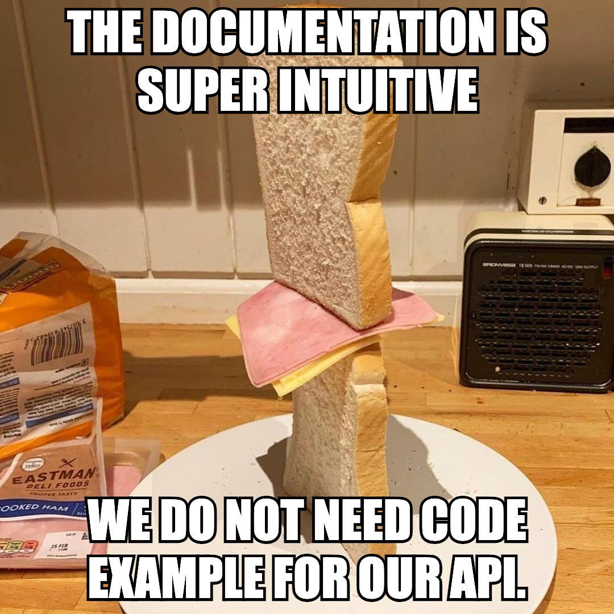

**Wpis pochodzi z serii poświęconej budowaniu dokumentacji. Poprzednik
(_["dla kogo"](./dla-kogo-piszemy-dokumentacje.md)_) wskazał podmioty
zainteresowane naszymi treściami, którymi musimy się zaopiekować. Ostatni wpis
serii odpowie na zagadnienie _"jakimi narzędziami"_.**

Wyobraź sobie, że właśnie dołączyłeś do nowej organizacji. Odebrałeś sprzęt od
kuriera wraz z danymi do logowania. Jesteś podekscytowany — w końcu zmieniłeś
pracę, bo w poprzedniej brakowało ci wyzwań. Zostajesz wprowadzony do
obowiązujących praktyk oraz zasad w firmie, a następnie twój przełożony
przedstawia cię w zespole.

W tym momencie pada klasyczny, aczkolwiek dosyć kluczowy zwrot od twojego
lidera:

> _Na spokojnie zapoznaj się z naszą dokumentacją. Nie wszystko może być
> aktualne, natomiast sekcje X i Y mogą okazać się pomocne. Daj znać, jak
> skończysz konfigurować sprzęt i zapoznawać się z materiałami, to pogadamy o
> pierwszym zadaniu!_

Jak myślisz, czy to, co spotkasz, jest tym, czego potrzebujesz na tym etapie?
Nasuwa mi się pytanie — czego spodziewać się po dokumentacji zespołowej?

## Wiedza przychodzi z doświadczeniem.

Zazwyczaj nie musisz czegoś rozumieć, dopóki nie masz potrzeby tego poprawiać
(lub zmieniać). Nieważne czy jest to błąd w systemie, drobna poprawka, za którą
się zabrałeś, czy rozszerzenie działającej funkcjonalności.

Kiedy bierzesz coś pod lupę, najczęściej zaczynasz od szybkiej próby
zrozumienia, jak dany komponent działa. Może system został przygotowany z myślą
o twoim problemie, a może właśnie celowo pominął dany przypadek brzegowy ze
względu na swoją charakterystykę. Ktoś przecież zaprojektował dany proces
biznesowy, więc gdzieś ekstrakt tej wiedzy domenowej jest. Jeśli wszystko dobrze
poszło, to nie jest w głowach ludzi a w dokumentacji.

I choć form na spisywanie wiedzy można wymieniać i wymieniać, skupię się na
kilku, które w mojej ocenie szczególnie się sprawdzają.

### Obraz wart tysiąca słów

To dość popularne powiedzenie, na które
[powołuje](https://blogs.sas.com/content/hiddeninsights/2022/12/19/obraz-wart-tysiaca-slow-troche-historii-i-obecnie/){:target="\_blank"}
się wiele osób przy różnych okazjach. Skąd się wzięło? Jedni przypisują go
Napoleonowi Bonaparte, który miał stwierdzić, że _"dobry szkic jest lepszy niż
długa mowa"_. Inni wskazują na Leonarda da Vinci, któremu przypisuje się
stwierdzenie, że poeta zostanie _"pokonany przez sen i głód, zanim opisze
słowami, co malarz jest w stanie wyrazić w jednej chwili"_. Jednak bez względu
na pochodzenie frazy, chodzi tutaj o dwie rzeczy, czyli wartość informacyjną
połączoną z klarownością przekazu.

Wyobraź sobie, że próbujesz przekazać hierarchię zarządzania organizacją za
pomocą samego tekstu. Albo spróbuj opisać złożony proces biznesowy z wieloma
punktami decyzyjnymi bez żadnej grafiki pomocniczej.

To brzmi jak koszmar... prawda?

#### Diagramy

Wychodzę z założenia, że dobry diagram jest znacznie bardziej efektywną formą
przekazywania wiedzy niż surowy tekst, bo wizualne przetwarzanie informacji
przychodzi nam po prostu mniejszym nakładem energii.

I nie mówię tu nic odkrywczego – psychologia poznawcza mówi od lat o
[efekcie przewagi obrazu nad słowem](https://en.wikipedia.org/wiki/Picture_superiority_effect){:target="\_blank"}.
MIS Research Center, badając różne rodzaje prezentacji, doszło do wniosku, że
prezentacje zawierające _"przemyślaną"_ warstwę wizualną były o 43% bardziej
przekonujące niż prezentacje czysto tekstowe. Pomoce graficzne, zwłaszcza
barwne, poprawiały uwagę słuchaczy, zrozumienie, a także ich opinię w ramach
wiarygodności i profesjonalizmu prezentera.

Wezmę jeszcze komentarz z własnego podwórka:

> _Nie mam czasu na czytanie tego wszystkiego..._

Świat tonie w informacjach i wszyscy to wiemy. Powtórzę się, że to nic
odkrywczego, bo Grupa Nielson Norman
[zbadała](https://www.nngroup.com/articles/how-little-do-users-read/){:target="\_blank"}
dawno temu, w jaki sposób użytkownicy czytają treści w Internecie. Ich wynik, że
internauci czytają tylko około 25% treści na stronach, raczej dziś nikogo nie
zaskakuje. Podczas badań, przyjemne dla oka, ale nieistotne grafiki zostały
całkowicie
[zignorowane](https://www.nngroup.com/articles/photos-as-web-content/){:target="\_blank"},
natomiast użytkownicy spędzali znacząco więcej czasu na przeglądaniu diagramów
oraz ich objaśnień.

Po tym przydługawym wstępie przejdźmy do konkretów 😅. Nie ma co tutaj odkrywać
koła na nowo. Masz do przekazania wiedzę, to pamiętaj o perspektywie czytelnika.
Jeśli twoim docelowym
[odbiorcą](https://documentwrite.dev/blog/stop-writing-documentation-that-no-one-reads-know-your-audience/){:target="\_blank"}
jest inżynier, to nie rób mu pod górkę i zamiast ściny tekstu przygotuj mu
diagram — bo
[UML-e](https://en.wikipedia.org/wiki/Unified_Modeling_Language){:target="\_blank"}
po prostu działają. I nie jest ważne, z jakiego narzędzia skorzystasz, żeby jest
wygenerować – czy to będzie narzędzie typu
[drag-and-drop](https://en.wikipedia.org/wiki/Drag_and_drop){:target="\_blank"},
czy coś
[inspirowanego na bazie na Markdown](https://mermaid.js.org/){:target="\_blank"}
(a o narzędziach w kolejnym wpisie). Ważna jest intencja i odbiorca.

Gdybym miał wymienić moich ulubieńców to zdecydowanie by to byli:

-   Do przepływów między usługami i zależnościami między funkcjonalnościami
    nadaje się świetnie
    [diagram sekwencji](https://en.wikipedia.org/wiki/Sequence_diagram){:target="\_blank"}.

    I to mój zdecydowany ulubieniec. Jest jak Rafaello... wyraża więcej niż
    tysiąc słów. Działa na różnych poziomach, można go zastosować zarówno do
    bardziej technicznych aspektów, jak i do biznesowych czy integracyjnych.
    Świetnie sprawdza się jako podstawa pod rozpoczęcie dyskusji czy jako
    potwierdzenie ustaleń.

-   Jeśli w systemie są stany i przejścia (a zazwyczaj są) to mamy do czynienia
    z
    [diagramem stanów](https://en.wikipedia.org/wiki/UML_state_machine){:target="\_blank"}.

    Dla mnie jest to niezbędnik, gdy pracujemy z
    [maszynami stanów](https://blog.allegro.tech/2021/03/state-machines-made-easy.html){:target="\_blank"}
    i koordynujemy złożone procesy. Przejścia potrafią się mocno skomplikować i
    bez dobrej interpretacji graficznej można się pogubić.

-   W ramach modelowania procesów biznesowych sprawdza się
    [diagram aktywności](https://en.wikipedia.org/wiki/Activity_diagram){:target="\_blank"}.

    -   Lub do przypadków użycia typowe
        [use case'y](https://en.wikipedia.org/wiki/Use_case_diagram){:target="\_blank"}.

-   Przy przygotowywaniu HLA i dekompozycji architektury może sprawdzić się
    [model C4](https://en.wikipedia.org/wiki/C4_model){:target="\_blank"} albo
    [diagram komponentów](https://en.wikipedia.org/wiki/Component_diagram){:target="\_blank"}.

    I mimo że pół branży IT mówi dziś właśnie o C4 to osobiście cały czas mam
    problem się do niego przekonać. Tak jak _Context diagram_ (poziom 1) ma
    swoją rację bytu, to moja awersja pozostaje w związku z częstymi zmianami
    architektury. Co do zasady najczęściej kończę z jakimś mniej unormaizowanym
    formatem wynikającym z narzędzia, z którego aktualnie korzystam. Wynika to z
    wygody i pragmatyzmu. Muszę mu dać kiedyś jeszcze szansę...

Jeśli jesteś zainteresowany głębszą analizą samych diagramów to zachęcam do
lektury
[_"Why Are Diagrams So Powerful"_](https://drawio-app.com/blog/why-are-diagrams-so-powerful)
od draw.io.

#### Sesje i warsztaty

Tutaj raczej krótko — wyniki spotkań takich jak
[sesje stormingowe](https://www.eventstorming.com/){:target="\_blank"} (czy to w
formie tablic, czy nagrań) to istotny fragment odkrywania domeny i ich materiały
są swego rodzaju formą dokumentacji (choć nie taki jest ich cel). Często, na tym
etapie dosyć nieuporządkowaną, natomiast zazwyczaj wnoszącą dużo wartości,
zwłaszcza dla nowo dołączających członków do zespołu, kiedy _"prawdziwa"_
dokumentacja nie jest gotowa. Takie eksploracje pokazują, jak skomplikowana jest
domena, czy ile mamy różnych kontekstów do zaopiekowania się.

Problem w tym, czy to jest coś, do czego powinniśmy odwoływać ludzi. Więcej tam
zazwyczaj niewiadomych niż objaśnień, więc prędzej będą sfrustrowani niż znajdą
odpowiedzi na nurtujące ich pytania – zwłaszcza że wiedza stamtąd mogła już
dawno się zdezaktualizować. Trochę to twardy orzech do zgryzienia, więc
zostawiam to tobie do oceny.

## Jak cię widzą, tak cię piszą.

Co robisz, kiedy musisz zapoznać się z nowym rozwiązaniem przygotowanym przez
inny zespół? Załóżmy, że dokonujesz wyboru czy zdecydujecie się na daną
technologię podczas nadchodzącego sprintu, czy też nie. Czego zaczniesz szukać
na początku? Ogólnych zasad działania? Ograniczeń? Alternatyw? Zespołów, które
już mu zaufały? Ciężko stwierdzić... trochę to zależy od tego, co spotkasz.
Jeśli produkt będzie poprawnie opisany, to najprawdopodobniej wzbudzi w tobie
zaufanie. W końcu masz do czego wrócić w trakcie implementacji i nie musisz
patrzeć w kod, czy domyślać się jak zachowa się dana funkcjonalność. I właśnie
ten pierwszy moment jest bardzo ważny.

Porozmawiajmy chwilę o kontraktach. Budując bibliotekę czy wystawiając API na
świat, zazwyczaj tworzymy jakąś dokumentację. W końcu chcemy, aby ktoś mógł
skorzystać z czegoś, co właśnie zbudowaliśmy. Staramy się opisać jak się
zintegrować z danym rozwiązaniem, jakie są możliwości konfiguracyjne czy jakie
ma ograniczenia.

To z czego warto zdać sobie sprawę, to fakt, że nikt od nikogo nie wymaga
długich wywodów tutaj. Czasem wystarczą dosłownie dwa zdania, diagram przepływów
czy wymienienie funkcjonalności.

Dla mnie takimi dwoma zdaniami w ramach udostępniania funkcjonalności (np. API
czy biblioteki), które robią różnice, są między innymi:

-   **[Specyfikacja OpenAPI](https://swagger.io/specification/){:target="\_blank"}** -
    automatycznie generująca się dokumentacja kosztuje nas tylko odrobinę pracy,
    a nie uwierzysz, jak dużo osób ją pomija. Komentarze do kodu dodajemy i tak,
    więc dodanie ekstra zdania w ramach publicznych kontraktów jest bardzo
    niskim kosztem w ramach zysku, który otrzymujemy. Nawet jak dziś wydaje ci
    się, że nikt nie będzie korzystać z twojej usługi, to czasem po prostu w
    ramach dobrych praktyk warto to dodać — a nuż ktoś będzie chciał poznać
    twoje API.

    Instalacja zazwyczaj sprowadza się do dodania paczki ze Swaggerem i
    dopisania kilku komentarzy o charakterze podobnym do notacji XML.

-   **["Sekcja "Jak zacząć" / Pierwsze kroki"](https://documentwrite.dev/blog/how-to-write-a-getting-started-guide/){:target="\_blank"}** -
    powtórzę się – naprawdę niewiele trzeba tutaj pisać. Jeśli budujesz
    bibliotekę, to powiedz, co należy dodać (krok po kroku), aby skorzystać z
    danej funkcjonalności. Pokaż przykłady użycia, w tym przynajmniej jeden
    bardziej zaawansowany. Opisz, na co zwrócić uwagę i jak się zachować przy
    typowych błędach.

    A jeśli martwisz się, że to za mało, to nie ma o co — poprawisz przy
    pierwszych pytaniach. Gwarantuje ci, że szansa na to, iż wyczerpiesz temat,
    jest znacznie mniejsza, niż ci się wydaje. Bardzo szczegółowe opisywanie ma
    również wady, bo łatwo się dezaktualizuje i wzbudza wśród inżynierów
    poczucie przytłoczenia ilością materiałów. Ważny jest tutaj balans.

    Część osób trzyma się schematu: _"Wstęp"_, _"Jak zacząć"_, _"Kolejne
    kroki"_. To prosty szablon, narzucający pewien sposób myślenia, który myślę,
    że można zarekomendować praktycznie każdemu.

#### Scenariusze przepływów

Odwróćmy teraz sytuację – spotykasz publiczne API, które jest słabo opisane, a
musisz przekazać wiedzę dalej. Co teraz?

Kiedy już dochodzisz do źródła prawdy, niezależnie czy poprzez zadawanie pytań,
czy ktoś zrobił ci wstęp do danej technologii (więc znasz już scenariusze
użycia), to czasem procesy wymagają po prostu szeregu czynności wykonanych w
odpowiedniej kolejności. Jeśli chcemy wykonać przykładowo płatność na
platformie, to najpierw musimy stworzyć ją, potem dokonać autoryzacji
transakcję, a na koniec ją zaakceptować. Wyniki z pierwszej operacji są
najczęściej danymi wejściowymi dla drugiej. Oczywiście mógłbyś opisać słownie,
co się dzieje po czym, ale czasem łatwiej jest po prostu to wykonać, bo w końcu
i tak musiałeś przetestować czy dana funkcjonalność w ogóle działa.

<!-- markdownlint-disable -->

{:style="border:0.2em solid #000000db;margin-top:0.6em"} 
    <em>Źródło: 
    [Reddit](https://www.reddit.com/r/ProgrammerHumor/comments/lswk9r/the_documentation_is_super_intuitive_we_do_not/){:target="\_blank"}
    </em>
 
<!-- markdownlint-restore -->

Więcej o narzędziach będzie w kolejnym wpisie, ale osobiście właśnie do takich
wykonywań, w ramach weryfikacji API bardzo cenię sobie dodatek do IDE o nazwie
[REST Client](https://marketplace.visualstudio.com/items?itemName=humao.rest-client)
(oparty o pliki z rozszerzeniem `.rest` lub `.http`). Jako zespół,
przygotowujemy z tym narzędziem całe scenariusze, co po czym ma się wydarzyć.
Dużą zaletą jest możliwość dodawania ich do repozytorium GIT, gdzie są blisko
samej implementacji (lub użycia), co pozwala też łatwo śledzić historię zmian.
Alternatywnie w ramach testów API całkiem nieźle sprawdza się również
[Postman](https://www.postman.com/).

## Duża organizacja to duża odpowiedzialność

Szkoła się skończyła, a dyżury zostały. Jeśli nie wiesz, o czym mówię, to
zazdroszczę, bo w przypadku gdy pracujesz nad systemem, który jest dostępny dla
klientów 24/7 i przynosi znaczące dochody dla organizacji to chleb powszedni.

Weźmy sobie za przykład sklep internetowy. Zakupy muszą się udać o każdej porze
dnia i nocy. Jeśli coś jest nie tak, to ktoś nie śpi. Życzę ci, żebyś to nie był
ty. Kiedy natomiast trafia na ciebie to czas gra role. W końcu każda minuta
przekłada się na pieniądze, których klienci nie wydali na danej platformie.
Gdyby tak nie było, to nie byłoby żadnych dyżurów przecież. Ważne jest, żeby
dyżurujący wiedział co robić — problemy lubią się ponawiać, dostawcy usług
miewają czkawki, a błędów na produkcji nie unikniemy (w końcu wdrażamy nasze
usługi codziennie... i to wielokrotnie). Dodatkowo nie da się znać całego
ekosystemu — zawsze dojdzie do jakiegoś silosowania wiedzy.

O co w takim razie dbać, żeby nasi dyżurujący byli w stanie jak najszybciej
rozwiązywać problemy? Szkół jest kilka. Ja podzielę się tym, co sprawdza się u
nas czyli scenariusze do inwestygacji. Pojawiają się czasem też pod nazwą FAQ
oraz ["Playbooks"](https://sre.google/workbook/on-call/){:target="\_blank"}. Nie
mamy jednego formatu dla nich, bo i jest wiele zespołów, którym sen spędzają z
powiek inne kaprysy systemów więc i są inne problemy do rozwiązania.
Standaryzacja niewiele by tutaj raczej wniosła. To zespół jest odpowiedzialny za
wypracowanie sobie narzędzi, które pozwolą im sprawnie rozwiązywać problemy —
więc i format powinni wybrać sami.

Nie wszystko da się zautomatyzować i przewidzieć, a zadaniem tych scenariuszy
jak opisanie jak zachować się w danej sytuacji. Przykładowo:

-   **Znane problemy** — usługa X przestaje odpowiadać albo rzuca wyjątkami.
    Gdzie dzwonić, co robić?
-   _"Na
    [DLQ](https://en.wikipedia.org/wiki/Dead_letter_queue){:target="\_blank"}
    trafiło X wiadomości w związku z Y. **Zrób to i tamto**. Potem sprawdź
    tutaj."_
-   _"Przestaliśmy być dostępni jako metoda płatności. **Istnieją 3 powody**.
    Sprawdź je."_

Warto też w ramach konkretnych
["czujek" (alarmów)](https://support.pagerduty.com/docs/alerts){:target="\_blank"}
na monitoringu od razu dodawać odnośniki do dokumentacji danego narzędzia.
Potrafi uratować sporo czasu.

### Informuj jakie kroki podejmujesz

Podczas dyskusji w biurze usłyszałem również opinię:

> _Dobrze sprawdza się porządne komentowanie co robię podczas inwestygacji.
> Kolejnego dnia, można zrobić retrospektywę, co można było zrobić lepiej i
> gdzie mieliśmy szczęście (przydaje się do
> [postmortem](https://www.atlassian.com/incident-management/postmortem){:target="\_blank"}).
> Jest to również niezła wartość merytoryczna dla kolejnych dyżurujących. Czasem
> po prostu wchodzą na Slacka i wpisuje wyszukiwarce problem. Niekiedy można
> znaleźć ponawiającą się rzecz po kilku latach._

Brzmi jak nic wielkiego, ale co ciekawe, jest znacznie częściej otwieraną
zakładką w dokumentacji, niż człowiek by się spodziewał. Nie raz spisałem coś z
myślą, że przecież nikomu się to nie przyda i prawie za każdym razem byłem w
będzie.

A więc jeśli masz to szczęście (lub i nie) brać udział w dyżurach to pomagajcie
sobie. Piszcie dla siebie instrukcje i opisujcie co robicie. Jeszcze sobie
będziecie dziękować wzajemnie za tego typu wsparcie w boju.

## Nie ma złych decyzji. Są tylko te niespisane.

O wartości
[Architecture decision record (ADR)](https://github.com/joelparkerhenderson/architecture-decision-record){:target="\_blank"}
mówił już dawno temu cały świat i postało tyle materiałów, że nie warto się
tutaj powtarzać. Kilka moich ulubionych do nadrobienia, jeśli jeszcze nie miałeś
okazji się zapoznać:

-   [Scaling Engineering Teams via RFCs: Writing Things Down](https://blog.pragmaticengineer.com/scaling-engineering-teams-via-writing-things-down-rfcs/){:target="\_blank"}
-   [Design Docs at Google](https://www.industrialempathy.com/posts/design-docs-at-google/){:target="\_blank"}
-   [Technical Decision-Making and Alignment in a Remote Culture](https://multithreaded.stitchfix.com/blog/2020/12/07/remote-decision-making/){:target="\_blank"}

<!-- https://caitiem.com/2020/03/29/design-docs-markdown-and-git/ -->

Jaki ma to związek z dokumentacją? Przykładowo skąd dowiesz się, czym firma
zajmowała się przez ostatni rok? Przecież nie będziesz przeglądać historii zmian
itd. Log decyzji to właśnie to miejsce. Istnieje mnóstwo decyzji które padło,
wiele pytań, na które odpowiedzieli sobie inżynierzy itd. Kiedy podejmujemy
decyzje, robimy to na podstawie aktualnie naszej najlepszej wiedzy. I za rok
oczywiście może być kompletnie inna. Ważne jest spisanie, w jakim kierunku wtedy
idziemy i dlaczego.

W organizacji trzymamy się dosyć prostego schematu: _"Kontekst i problem"_, _"Co
chcemy (i jakie są czynniki decydujące)"_, _"Jakie mamy możliwości (i ich
konsekwencje)"_ oraz oczywiście _"Decyzja"_. Pytania, choć wydają się proste,
zazwyczaj wymagają nieco zastanowienia się.

To, co dla mnie jest istotne to żeby nie mylić ADR-a z
[RFC](https://en.wikipedia.org/wiki/Request_for_Comments){:target="\_blank"} -
jedno to już podjęta decyzja, a drugie to dokument wspomagający dyskusji. Do
tego drugiego osobiście preferuje inne narzędzie do szybkiej kolaboracji z
komentarzami i sugestiami niż GIT i
[PR/MR](https://docs.github.com/en/pull-requests/collaborating-with-pull-requests/proposing-changes-to-your-work-with-pull-requests/about-pull-requests){:target="\_blank"}
(przykładowo Google Docs). Po pierwsze każdy zawsze ma repozytorium, a dodatkowo
biznes raczej nie jest wymiataczem systemów kontroli wersji.

Przykładem decyzji w dużej organizacji może być niedecydowanie się na migracje
na najnowszą wersję
[SDK](https://learn.microsoft.com/en-us/dotnet/core/sdk){:target="\_blank"}.
Choć serce się czasem kroi, kiedy widzi się tego typu decyzje, to często są po
prostu pragmatyczne. Nie każda wersja jest
[LTS](https://en.wikipedia.org/wiki/Long-term_support){:target="\_blank"} lub
duże aktualizacje wychodzą z bardzo dużą częstotliwością. Zespoły platformowe
zazwyczaj nie zakazują wykorzystywania innych wersji, natomiast z ich strony
wychodzi jasna rekomendacja (mówiąca np. że twoja migracja nie może zmusić
innych do tego samego) i konsekwencje niepodążania za daną ścieżką.

I na koniec – nie istnieje żaden złoty podział między wystarczająco ważną
decyzją a tą, której nie warto spisywać. Jeśli czujesz, że decyzja może mieć
konsekwencje, to sam fakt spisania zazwyczaj pozwoli ci poukładać sobie to w
głowie. Wiec nie myśl o tym za długo — po prostu spisz, jeśli widzisz w tym
wartość.

## To nie czas na afiszowanie się?

Chwalenie się osiągnięciami może zostać postrzeżone w organizacji dwojako,
prawda? Część osób nie jest fanem mówienia o swoich dokonaniach, bo nie widzi w
tym wartości. Pytanie, czy na pewno dzielenie się podsumowaniami pozytywnych
zmian jak optymalizacje, czy to finansowe, czy wydajnościowe jest złe?

Dla mnie osobiście to świetna chwila, żeby nauczyć się czegoś od innych. Poznać
problem, rozwiązanie i efekt zmiany. To też dobra okazja dla nowozatrudnionych
na zobaczenie czym firma się zajmowała. Swego czasu mieliśmy różne inicjatywy w
ramach bolączek związanych z naszym dostawcą chmury publicznej — był jakiś
kontekst, metryki i analiza, opisane różne znaleziska, wnioski i pomysły na
usprawnienia. Osobiście uważam, że to ogromna wartość, która niestety, ale
najczęściej zostaje w naszych głowach jako operatorów tego przedsięwzięcia.
Jestem zdania, że choć zespoły częściej niż czasem mierzą się z tymi samymi
problemami, to nie dzielą się swoimi odkryciami. A co gorsza jest to też duże
wyzwanie zebrać różne zespoły w jednym miejscu, żeby powymieniały się swoimi
doświadczeniami.

Dążę do tego, że dzielenie się w formie offline pisząc właśnie podsumowania,
badań, szczęśliwe historie czy sukcesy wdrożeniowe ma wartość (nie tylko na
spotkaniach itd). Trudno ją kwantyfikacji wniesionej wartości w stosunku do
spędzonego czasu na pisanie, ale sama treść merytoryczna jest najczęściej
przydatna. A już nie będę tutaj mówić o tym, że w ramach zespołu jest dobrym
sposobem na ekspozycję i
[sponsorship](https://larahogan.me/blog/what-sponsorship-looks-like/){:target="\_blank"}
konkretnych osób.

---

## Nie rób innym koło pióra.

Zmierzając już ku końcowi, podsumujmy jeszcze, czego nie warto robić i na co
zwrócić uwagę. Kilka punktów, wymienionych podczas jednej z wewnętrznych
dyskusji:

-   **Duplikacja to wróg numer jeden** — jeśli potrzebujesz w swojej
    dokumentacji powielić coś, co widziałeś już gdzieś indziej, to dodaj po
    prostu odnośnik do tamtej. Raz, że nie musisz utrzymywać tej treści, a dwa,
    że jeśli coś się zmieni to szansa na to, że ktoś poprawi twoją kopię, jest
    zerowa.
-   **Oznaczanie dokument jako _"nieaktualny"_ bez informacji gdzie pójść
    dalej** to patologia — klasyk. Ta wersja jest już niedostępna, a ty domyśl
    się gdzie szukać najnowszej wersji.
-   **Trzymanie dokumentacji technicznej daleko od implementacji** jako
    gwarantowany sposób na dezaktualizację. Jeśli ktoś poprawia dany fragment
    funkcjonalności, to nie każmy mu szukać, gdzie powinien zaktualizować
    dokumentację do tego.
-   **Nie warto opisywać wszystkiego** — dokładna implementacja, szybko
    zmieniające się elementy, czy opisywanie pola, które samo już z nazwy mówi o
    sobie wystarczająco to przesada. Czasem gdzieś standardy na nas wymuszą
    pewne zachowania, ale kiedy muszę pole "pesel" opisać "To pole zawiera
    pesel", to krew mnie zalewa. Dobrze jest unikać opisywania oczywistości
    (choć tu zdania są podzielone).

Mam nadzieję, że ten wpis pozwoli ci spojrzeć na wybieranie tego, co należy
opisywać z innej strony. Dzięki za uwagę.
