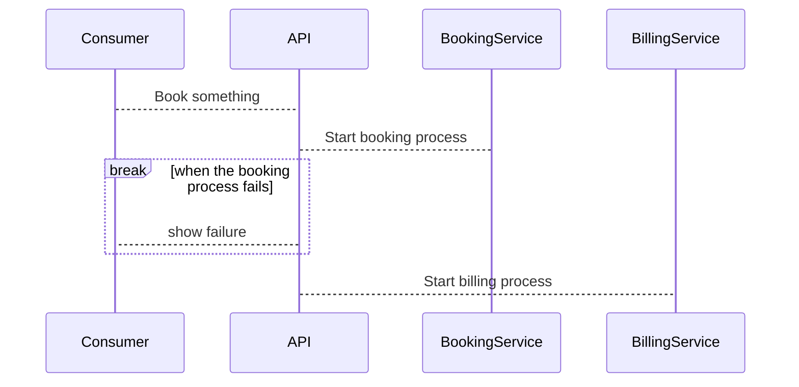
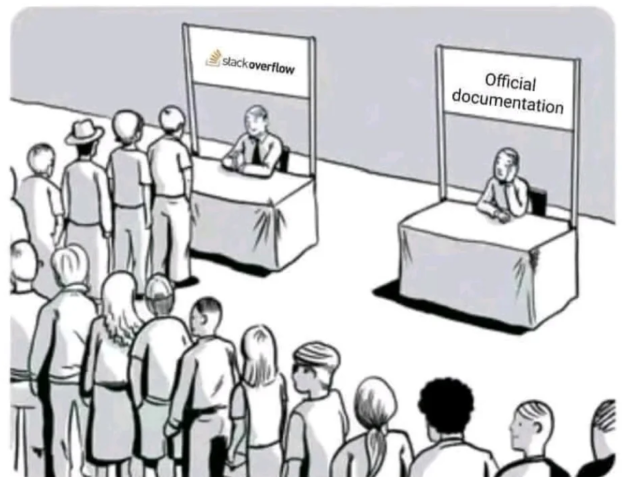
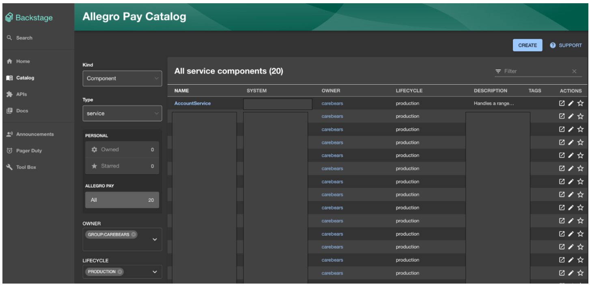
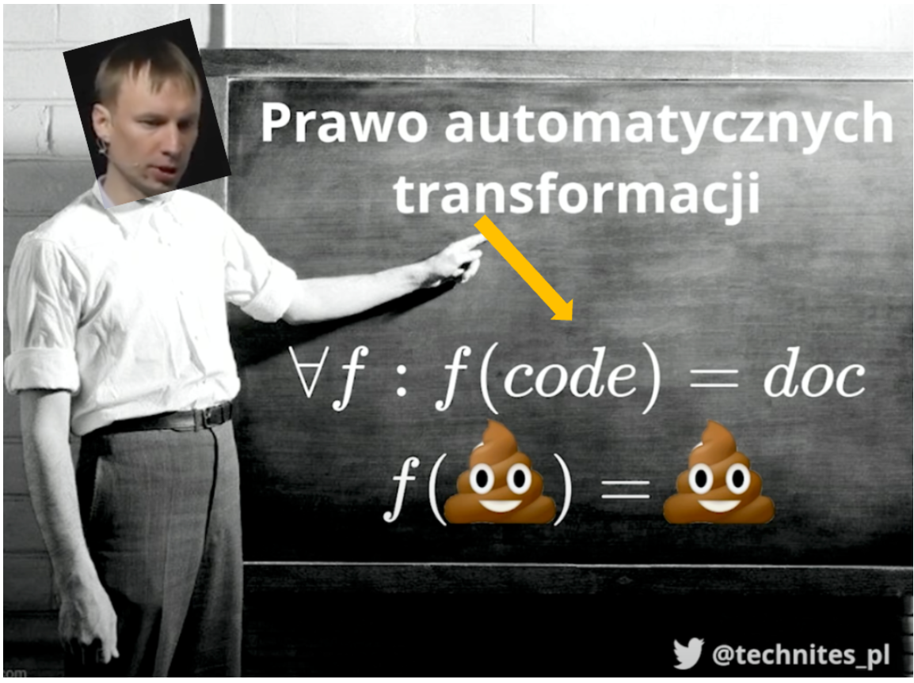

Wpis pochodzi z serii poświęconej budowaniu dokumentacji. Opisane zostały już
dwa zagadnienia czyli
_["dla kogo piszemy?"](./dla-kogo-piszemy-dokumentacje.md)_ oraz
_["co warto opisywać"](./co-dokumentujemy-a-co-powinnismy.md)_. Zagadnienie
_"jakimi narzędziami"_ zamyka tę trylogię.

Uwielbiam eksperymentować - dodawać nowe biblioteki, sprawdzać narzędzia i
optymalizować swoją pracę. Kolejność wpisów w tej serii nie była jednak
przypadkowa. Mógłbym od razu pokazać z czego korzystamy w naszej organizacji i
kropka. Cel miałem natomiast nieco inny, bo zależało mi na podkreśleniu tego, że
tooling jest wtórny, a liczy się intencja. Ale skoro udało Ci się już przejść
przez poprzednie kroki to czas na wisienkę na torcie inżynierskim czyli zabawki.

## Kontynuacja o diagramach

Podczas wywodu o diagramach wspomniałem, że możemy skorzystać z czegoś opartego
o Markdown - i to będzie moje pierwsze narzędzie na rozgrzewkę czyli
[Mermaid](https://mermaid.js.org/intro/){:target="\_blank"}. Myśl przewodnia
jest mniej więcej taka:

> _Mermaid pozwala tworzyć diagramy i wizualizacje za pomocą tekstu i kodu._

Dla mnie bomba. Piszę readme i zaraz obok mogę dodać diagram, bez podpinania
bibliotek bo więksi gracze jak GitHub wspierają to z pudełka. Bez kroku
kompilacji, którym muszę się przejmować (jak w PlantUML) i bez linków do
zewnętrznych platform (jak w draw.io). Narzędzie nie jest idealne, ma swoje
ograniczenia, ale w gruncie rzeczy po prostu daje radę. Znajdą się przypadki
gdzie konkurenci wymienieni wyżej lepiej sobie radzą z bardziej skomplikowanymi
strukturami, ale to kompromis, na który się godzę. Składnia jest bardzo prosta,
a efekty widać natychmiast.

```text
sequenceDiagram
    Consumer-->API: Book something
    API-->BookingService: Start booking process
    break when the booking process fails
        API-->Consumer: show failure
    end
    API-->BillingService: Start billing process
```

A efekt? Aż sobie podpiąłem mermaid do mojego bloga, bo to narzędzie do
tworzenia diagramów i wykresów oparte na JavaScript, które renderuje w locie.
Możesz nacisnąć "CTRL/CMD + F" i wyszukać "API" - wygenerowany ".svg" jest
przeszukiwalny.



Typów diagramów jest bardzo dużo - od sekwencji, klas, stanów, encji po C4. Jest
też sporo eksperymentalnych typów, która mam nadzieje, że niedługo wypróbuje jak
mindmapy, bo do dziś opierałem się głównie o miro w tej kwestii.

## Gdzie to w zasadzie trzymać

Mam wrażenie, że chyba każdy spotkał się z problemem dostępności i rozproszenia
dokumentacji. Jako inżynier szukam kluczowych informacji - chcę szybko rozwiązać
mój problem i kontynuować pracę nad zadaniem. Jako przykład dajmy sobie
StackOverflow - to platforma, na której błyskawicznie można znaleźć rozwiązania
na swoje problemy. Jakbym miał napisać wzór na nią to byłoby to coś takiego:

> **Stack overflow = odpowiednia grupa docelowa \* wartościowe przykłady**

<!-- markdownlint-disable -->
<span style="float:right;width:40%;margin:0.5em;text-align:center">

    <em>Źródło: Reddit</em>
</span> 
<!-- markdownlint-restore -->

Dodałbym tutaj jeszcze jedno - czyli to, że to żyjąca dokumentacja. Wychodzi
wyższe SDK? Oto i przykład z nim. Nowy [syntactic sugar](https://en.wikipedia.org/wiki/Syntactic_sugar){:target="\_blank"}? Proszę bardzo tutaj masz
krótszą składnie. Rozwiązanie wręcz idealne. Kiedy natomiast oficjalna
dokumentacja nie otrzymuje tyle uwagi co powinna to mamy problem. Oznacza to
tyle, że albo nie jest wystarczająco kompleksowa, albo nie da się jej znaleźć. O
kompletności już nieco sobie powiedzieliśmy, że sztuką nie jest wyeliminowanie
kontaktów całkowicie, a jedynie ich ograniczenie, więc weźmy na warsztat teraz
dostępność.

Z mojego doświadczenia obozy są zazwyczaj dwa - albo masz rozwiązanie oparte o
GITa, albo jakiś interfejs graficzny typu Confluence czy stos od Google (Docs +
Drive).

-   Jeśli pójdziesz w pierwszy wariant to potrzebujesz najczęściej czegoś do
    renderowania markdown. Jedni wybierają MkDocs, inny Hugo albo Gatsby - czyli
    jakiś Static Site Generator. Potem tylko wdrożenie tego - my w organizacji
    najczęściej wybieramy GitHub Pages.
-   W przypadku drugiego jesteśmy skazani najczęściej na samodyscyplinę. Dobra
    struktura jest tutaj naszym przyjacielem. Łatwo jest o śmietnik jeśli zbyt
    duża grupa pracuje na jednym drzewie. Ponadto w przypadku stosu Google
    tracimy możliwość wyszukiwania w wielu dokumentach. Są na to rozwiązania jak
    Glean, natomiast jest to płatne oprogramowanie, a utrzymanie takiego indeksu
    nie należy do najtańszych.

My wybraliśmy GITa do dokumentacji technicznej, a Google Docs traktujemy jako
narzędzie do kolaboracji (nie jako dokumentacja - to pliki na chwilę /
tymczasowe). W ten sposób natomiast sami stworzyliśmy sobie problem bo musimy
utrzymywać i zarządzać rosnącą ilością różnych dokumentacji, wiele pages itd.
Potrzeba na narzędzie do agregacji tej rozproszonej wiedzy pojawiła się dosyć
naturalnie.

Żeby rozwiązać nasz problem w organizacji skorzystaliśmy z Backstage - dostarcza
on scentralizowany hub gdzie zespoły mogą kategoryzować i wyszukiwać różne
komponenty oraz materiały w ramach całej firmy. Sam katalog komponentów (czyli
serce tego narzędzia) to lista po której możemy wyszukiwać wszelkie serwisy,
biblioteki itd. Typowe filtry obejmują między innymi:

-   Rodzaj: Usługa (serwis), API, Biblioteka itd.
-   Typ: Frontend, Backend i inne charakterystyki,
-   Właściciel: Zawężenie po zespole, produkcie,
-   Status: Aktywny, Przestarzałe, Zarchiwizowane.

Poza osadzaniem komponentów rozwiązanie może też pełnić rolę indeksu dla
dokumentacji - jest wtyczka do mkdocs, i można osadzać wiele statycznych stron w
środku samego backstage. I to robi wrażenie - ma swoje bolączki, jak każde
narzędzie, ale z dwojga złego lepsze to niż całkowite rozproszenie. Zespoły mają
możliwość samodzielnych wdrożeń ich cegiełek i dokumentacji, a indeks pozwala im
wyszukiwać w ramach organizacji.

<!-- markdownlint-disable -->
<span style="width:100%;margin:0.5em 0;text-align:center">

</span> 
<!-- markdownlint-restore -->

Same szczegóły komponentów zostawiam do własnej eksploracji - powiem tylko tyle,
że zawiera on takie informacje jak opis, health checki, link do pages, czy
choćby graf zależności (to robi wrażenie). W dosyć prosty sposób można również
dodawać nowe wtyczki jak PagerDuty czy CI/CD z Azure Pipelines. Skąd się
natomiast biorą dane o tych komponentach? W każdym repozytorium trzeba zadbać o
dodanie stosownych metadanych - czyli catalog-info.yaml. Wygląda on przykładowo
tak:

```yaml
apiVersion: backstage.io/v1alpha1
kind: Component
metadata:
    name: entity-name
    description: entity-description
    title: entity-title
    annotations:
        backstage.io/techdocs-ref: dir:.
        pagerduty.com/integration-key: <pager-duty-integration-key>
    links: ...

spec:
    type: website | service
    owner: team-name
    lifecycle: production | experimental | deprecated
    consumesApis:
        - consumed-api
    providesApis:
        - entity-name-api
```

Kiedy pierwszy raz usłyszałem o pomyśle dodania tego pliku do 200+ komponentów w
ramach MVP to zrobiło mi się słabo. Na szczęście są takie rozwiązania jak
SourceGraph, które przychodzą z pomocą. Wykorzystując kilka konwencji
nazewniczych oraz funkcję Batch Changes, udało się w sposób w pełni automatyczny
wystawić PR/CR do wszystkich repozytoriów.

## Jak jeszcze można skorzystać z GITa

Commity robisz codziennie (lub często - w zależności od roli). Jednym z technik,
z którymi eksperymentowałem w poprzednim roku był Conventional Commit. Wierzę w
wartość małych i dobrze opisanych zmian i jestem fanem standardów (zdrowych).
Jeśli nie miałeś styczności to reguła jest bardzo prosta - trzymasz się
konwencji i tyle:

```text
<type>[optional scope]: <description>

[optional body]

[optional footer(s)]
```

Standard dla standardu? Jeśli tak uważasz to spójrz na chociażby conventional
changelog. Działa prawie jak magia - przy użyciu odpowiednich bibliotek i
konwencji jak tagi, otrzymujemy automatycznie generujący się changelog.
Osobiście pracuję głównie z Azure Devops Repositories, któremu jest daleko do
konkurencji i to była przyjemna odmiana dorobić sobie niejako własną wtyczkę.

## P3 czyli nawigator po systemie z różnych perspektyw

Jak widzisz dojrzałego ekosystemu dla dokumentacji wciąż brak - składamy z
klocków, które często do siebie nie pasują. Chciałbym podzielić się jeszcze
bardzo ciekawym narzędziem (i prezentacją) od Marcina Markowskiego. Prowadzi on
podczas swojej prelekcji przez fascynujące podejście do budowania materiałów
wspierających inżynierów za pomocą kodu. 

<!-- markdownlint-disable -->
<span style="float:right;width:40%;margin:0.5em;text-align:center">
{:style="border:0.2em solid #000000db;margin-top:0.6em"} 
    <em>Źródło: 
    [Youtube](https://www.youtube.com/watch?v=w1XDcNclHpE){:target="\_blank"}
    </em>
</span> 
<!-- markdownlint-restore -->


W materiale "Dokumentacja która sama
się pisze" można poznać nieco jego praktyk i podejść, a jednym z nich jest P3. Sama idea jest oparta o całkiem zabawne "prawo automatycznych transformacji":


To model (podejście) w którym do naszego kodu dodajemy adnotacje, z których
potem samo narzędzie buduje graf zależności. Sama zasada jest bardzo prosta, ale
rezultaty, które osiąga z tym są czymś co robi wrażenie. Przykład można zobaczyć
w [DDD-starter-dotnet](https://github.com/itlibrium/DDD-starter-dotnet){:target="\_blank"} - gorąco polecam.

---

Trudno jest wyczerpać temat budowania dokumentacji, a w każdej organizacji
praktyki są nieco inne. Ufam, że podejmiesz dobre decyzje, a te artykuły być
może pokazały ci nieco inną perspektywę.
