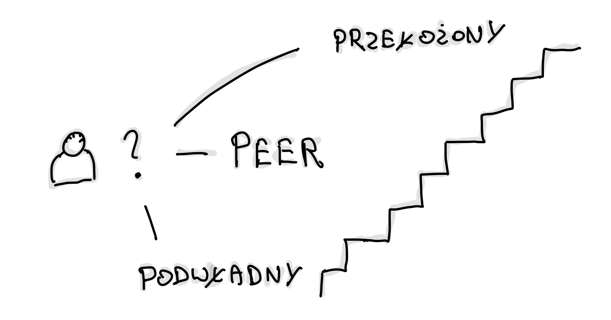
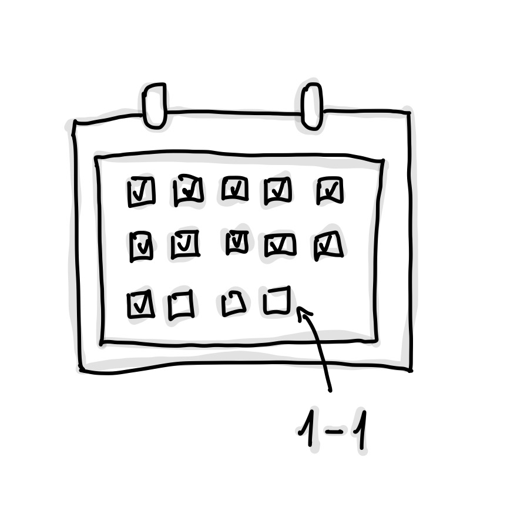
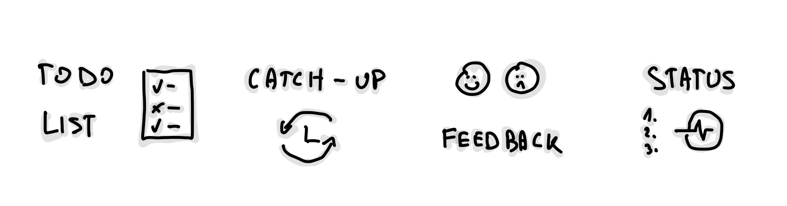

**One-on-one to spotkania, które budują relacje, wspierają rozwój i pozwalają
porozmawiać o bieżących sprawach. Dzięki różnorodności stylów, takich jak lista
TODO czy luźne catch-up'y, można dostosować formę rozmowy do swoich potrzeb.
Poruszam cel spotkań, optymalny czas (uwzględniając kalendarz), oraz z kim warto
je przeprowadzać. Materiał zawiera moje osobiste odczucia, jak wartościowe są to
rozmowy.**

Dziś porozmawiamy o fragmencie z książki
[The Managers Path od Camille Fournier](https://www.amazon.pl/Managers-Path-Leaders-Navigating-Growth/dp/1491973897/ref=asc_df_1491973897/?tag=plshogostdde-21&linkCode=df0&hvadid=504215809371&hvpos=&hvnetw=g&hvrand=5339223850458911222&hvpone=&hvptwo=&hvqmt=&hvdev=c&hvdvcmdl=&hvlocint=&hvlocphy=9067392&hvtargid=pla-315801134375&psc=1&mcid=48e843b914d43fe5ad16c68accf4a444){:target="\_blank"},
a dokładniej o wycinku związanym z 1-1. Ta część książki jest bardzo bliska
mojemu sercu.

Z uwagi na to, że pracuję głównie z zespołami z innych miast (czyli zdalnie),
kawa w biurze czy spontaniczne podchodzenia do biurek są dla mnie z każdym
rokiem coraz bardziej obce. Osobiście uważam, że sporo na tym tracę, nie żyjąc w
mieście, gdzie jest większość mojego zespołu, ale muszę sobie z tym jakoś
radzić. To decyzja, na którą się godzę, rozumiem co tracę, a co zyskuję.

Potrzebuję natomiast rozwiązania na moje potrzeby stąd i stawiam na one-on-one.

## Cel spotkania

Jeśli nie miałeś styczności z tego typu formatem, to jest to nic innego niż
pogadanka sam na sam (stąd te dwie jedynki w nazwie). Najbardziej typową relacją
jest rozmowa pomiędzy menedżerem (liderem) a osobą "pod nim". Preferuje poza
tego typu relacjami wybierać również te, które pomogą ci rozwijać się czy to
technicznie, czy miękko, w oderwaniu od swojego macierzystego zespołu.

Cytując Marca Hedlunda:

> _Regular 1-1s are like oil changes; if you skip them, plan to get stranded on
> the side of the highway at the worst possible time._

Świetna analogia, prawda? Trudno się z nią nie zgodzić. Po **pierwsze** to
idealne miejsce (możliwość) na prywatne przegadanie tematów, które powinny
zostać omówione. Potrzeby, problemy, wyzwania, sukcesy, porażki, frustracje.
Są tematy, które trzeba poruszyć i krępujące może być czasem pisanie o nich na
czacie (nie daj ktoś zrobi zrzut ekranu!).

Brzmi jak sesja terapeutyczna? Może i trochę tak, natomiast z drugiej strony
spektrum mamy rozwój, konsultacje (doradztwo) czy feedbacki.

Biorąc cytat od Camille:

> _For most people, good 1-1s are not status meetings. If you are a manager
> reporting up to senior management, you may use your 1-1 to discuss the status
> of critical projects, or projects that are still in the nascent stage where
> there’s not necessarily a lot written down yet. If you’re an individual
> contributor, though, a 1-1 as a status meeting is repetitive and probably
> boring._

Dla mnie spotkania typu 1-1, które kończą się statusem to żółta flaga i staram
się z tym walczyć, kiedy tylko mogę. Jedną z metod jest przenoszenie tego typu
dyskusji na planowania — łatwo jest ulec pokusie poświęcenia cennego czasu "sam
na sam" na rozmowie o bieżących sprawach projektowych. Wrócimy do tego w
ramach raportowania prac i daily rozmawiając o stylach różnych osób.

Po **drugie** to okazja na budowanie relacji. I nie mówię tutaj o spędzeniu
całego przeznaczonego czasu na hobby czy rodzinę albo pogaduchy o ostatnich
wakacjach, natomiast o dodanie szczypty swojego prywatnego życia, tak żeby mniej
więcej czuć kontekst sytuacji. Dobry menedżer zauważy spadek twojej energii
prawie na pewno, więc trzymam tylko kciuki, żeby miał odwagę i chęci zapytać,
czy wszystko jest okej, bo sytuacje w życiu są różne. Śmierć, dziecko,
wypalenie, zmęczenie materiałem, rozstanie.

## Z kim warto.

Drabinka korporacyjna ma trzy kierunki — do wyboru jest osoba na twoim poziomie
kariery (peer), niższym, czyli pod (podwładny) oraz wyższym, czyli nad
(przełożony). O pomijaniu szczebli porozmawiamy na koniec w skip level.

Decyzje musisz podjąć sam. Zachęcam cię obowiązkowo do posiadania 1-1 z
przełożonym oraz jeśli jesteś liderem to z osobami składającymi się na twój
zespół.

Oto kilka pomocniczych pytań, które mogą pomóc w decyzji czy warto spotykać się
z daną osobą:

-   Jak często bezpośrednio kontaktujesz się z tą osobą w ciągu tygodnia?

-   Jak dobre są twoje stosunki z nią?

-   Jak dużo wsparcia potrzebuje ta osoba / ty?

-   Jak dużo informacji przekazuje ci ta osoba / jak dużo ty przekazujesz jej?

Z czasem wypracowanie listy będzie przychodzić łatwiej. Będziesz czuł, gdzie
jest wartość (lub kto ma wartość ze spotkania z tobą), a gdzie jej nie ma.

## Kiedy

Mówi się, że poniedziałki i piątki to z reguły niebezpieczne terminy na 1-1 z
uwagi na przedłużanie weekendów (urlopy jednodniowe). Postaraj się
więc zaplanować je na godzinę i dzień, która pasuje zarówno tobie, jak i osobie,
z którą rozmawiasz. Jeśli to możliwe, spróbuj zorganizować to w dni, kiedy
chodzicie do biura.

Ja wolę robić je po południu — poranki staram się poświęcać na
"intensywną pracę" (wykluczając daily), czyli budowanie produktów,
programowanie, pisanie, nauka, czytanie. Ma to kilka mankamentów, między innymi
to, że w natłoku pracy łatwiej jest o przekładanie, przesunięcia, odwoływanie —
"muszę wyjść szybciej", jest coś "bardziej pilnego". W skrócie inne sprawy.

<!-- markdownlint-disable -->

<!-- markdownlint-restore -->

Jedna zasada tutaj — szanuj harmonogram drugiej osoby. Ważne, żeby wasze
spotkanie nie wpadło w środek waszych produktywnych godzin pracy. Zazwyczaj na
pierwszym takim pytam, jakie są jej preferencje czasowe, a na koniec dopytuje, w
jakiej częstotliwości moglibyśmy się spotykać.

Nie można zapomnieć również o wrzutkach, czyli ad-hoc'owych spotkaniach z
ludźmi, z którymi nie pracujesz na co dzień, lub robisz to po prostu rzadko. Do
przykładów mogę zaliczyć wyjaśnianie feedbacków po performance review, mentoring
w oderwaniu od zespołu w ramach szybkiej porady itd.

Ustawianie spotkań 1-1 w blokach również pomaga. Jeśli masz swój zespół, to
układanie jednego po drugim pomoże w utrzymaniu czasu, tak żeby się
niepotrzebnie nie rozciągały. To moja słabość — jak rozmawiam z osobą, z której
aż kipi wiedzą, trudno jest mi po 30 minutach się pożegnać.

## W jakim stylu

Z jakimi rodzajami się spotkałeś? Mam nadzieje, że odpowiedź nie brzmi "z
żadnymi, bo nie mamy w organizacji kultury tego typu spotkań". Jeśli jednak tak
jest, to mam nadzieję, że poniższa lista przybliży ci nieco samą koncepcję i
pozwoli wybrać pasujący styl do twojego charakteru. Pamiętaj, że wypracowanie
charakteru spotkania nie leży po jednej konkretnej stronie.

Miej w głowie zwrot:

> _It is not your manager’s job to completely control the 1-1 agenda (sometimes
> it will)_

Osobiście staram się zawsze przychodzić z agendą. Nie z każdą osobą
potrafię zebrać wystarczającą ilość tematów, ale zazwyczaj odrabiam zadanie
domowe. Jeśli temat nie jest poufny, to na kilka godzin przed spotkaniem wysyłam
listę rzeczy, które chciałbym dziś poruszyć.

Rzadko kiedy jest też tak, że czasu wystarcza na wszystkie tematy — i to jest
całkowicie normalne. Lepiej mieć za dużo niż za mało. Jak coś jest dla mnie
ważne, to po prostu daje to wyżej na liście.

Przechodząc więc do metodyk, z którymi się spotkałem:

-   **TODO list** — Zachęcam cię do dzielenia się "odpowiedzialnością"
    przygotowywania 1-1 ze swoim przełożonym. Przygotuj listę tematów, na
    których ci zależy. Zarządzaj czasem spotkania. Pamiętaj, że ono jest nie
    tylko dla jednej strony — przyszliście porozmawiać i macie oboje tematy.

    Jak budować listę? Zbieram tematy z całego tygodnia (lub miesiąca).
    Niewyjaśnione sprawy, ciekawostki, rzeczy, o które chce poznać opinię itd.

    W gronie osób, z którymi robię dziś spotkania, są głównie jednostki starsze
    ode mnie doświadczeniem życiowym i profesjonalnym, więc jest czego się
    uczyć.

    Typ ten jest najlepiej opisany w tym wpisie, bo go po prostu stosuję
    aktualnie. Na mojej TODO zazwyczaj poza zebranymi tematami znajdują się
    sekcje (w szablonie):

      <ol style="list-style-type: decimal">
      <li> **"(Nakierowana) kawa"** - czyli takie lean coffee 1-1. Jakaś ciekawostka z ostatnich dni na podstawie podcastu, książki, filmu, czasem prywata. Small talk pomaga mi na rozgrzewkę przy mniej rozmownej osobie. Pilnuj natomiast czasu - gaduły lubią przepalać go tutaj.  
      Część osób woli ten fragment robić na koniec, bo nigdy nie wiesz ile czasu zostanie. Ploteczki, luźne opinie o organizacji itd. Czyli najpierw relacja profesjonalna a potem koleżeńska. Zastanów się, którą czapkę chcesz nałożyć najpierw.</li>

      <li> **"Jakie są twoje tematy do mnie"** - warto jest dać się wypowiedzieć drugiej stronie najpierw jeśli ty masz dużo tematów. Jeśli jesteś liderem to tym bardziej. Po prostu pozwolić się jej wystrzelać z tematów.  
      Z czym przychodzą ludzie? "Ciężko mi się dogadać z X", "zadałem pytanie i od 3 dni wisi… potrzebuje eskalacji", "chciałbym zmienić zespół, pójść na turystykę", "jestem zmęczony stosem technologicznym i produktem", "czy możemy zorganizować warsztat z Y".  
      Weź pod uwagę również, że cisza może wynikać z introwertyczności. Jak przyjdziesz z górą pytań i nie dasz miejsca drugiej osobie się wypowiedzieć to dużo tracisz. Naucz się w ciszę i czuj z nią komfortowo - to instrument również do wyciągania informacji. Prędzej czy później ktoś coś powie.</li>

      <li> **(opcjonalnie) Feedback** - "Czy zauważyłeś ostatnio u mnie jakieś niepokojące zachowania", "Czy jest coś co ostatnio robię wyjątkowo dobrze" itd.  
      Czyli o postawie, dostarczaniu, podejściu czy mentalności. Ważne żeby to nie była laurka, a bardziej forma ["start, stop, continue"](https://miro.com/templates/start-stop-continue/){:target="\_blank"}. To też miejsce gdzie ty możesz dać drugiej stronie kilka słów otuchy.</li>

      <li> **Mentoring miękki i twardy** - porozmawiajmy o tematach, które są dla nas ważne. O przemyśleniach, poznawaniu drugiej perspektywy itd. Rzeczy, które możemy robić lepiej jako zespół oraz jednostki. Może jakiś ważny dla ciebie cytat z książki, o który chcesz podpytać. Planowanie celów rocznych. Nowa technologia, wzorzec - można wymieniać długo.</li>

      <li> **(opcjonalnie) Status** - *niezalecane na niższych szczeblach*</li>
     </ol>

    Część osób również zapisuje "co zostało powiedziane" i stara się notować
    rzeczy do zrobienia (action point-y). Uważam, to za najwyższy poziom
    wtajemniczenia. A jak czytasz je na koniec na głos? Chapeau bas.

    Natomiast jeśli zabrakło ci czasu na wszystko to, co robić? Masz trzy opcje:
    <ul>
    <li>dogrywka ważnych tematów (mało kiedy występuje),</li>
    <li>przeniesienie tematu na kolejne spotkanie (mój faworyt),</li>
    <li>dogadanie offline.</li>
    </ul>

    A co z przypadkiem, kiedy skończyły ci się tematy po 10 minutach? Tak też
    bywa. Jeśli to jest format, który wam odpowiada, to co ja będę mówić tutaj
    jak robić. Może być to natomiast sygnał — ktoś może nic nie mówić, a potem
    się zwalnia.

-   **Catch-up** — drugi format po liście, czyli format z ograniczonym formatem.
    W skrócie patrzysz, z czym przyjdzie do ciebie druga osoba na konsultacje.
    Część osób dodaje punkt z poprzednika, czyli zebrane tematów z całego
    tygodnia. Nazywany czasem po angielsku "driven by flow". Luźny i w mojej
    opinii czasem lubi przekształcić się w narzekanie i dramaty.

    Jedna rada od Camille w ramach narzekania:

    > _Try not to make every 1-1 about how you need something, how something is
    > wrong, or how you want something more. When you have a problem, instead of
    > demanding that your manager solve it for you, try asking her for advice on
    > how she might approach the problem. Asking for advice is always a good way
    > to show respect and trust."_

-   **Feedback loop** — dla mnie to ad-hoc'i. Wyjaśnianie feedbacku po
    performance review czy przychodzenie po feedback do osoby, od których trudno
    o pisemny.

    Ważny aspekt dla mnie to również reagowanie na nieakceptowalne sytuacje tak
    szybko, jak tylko to możliwe (natychmiast!).

    Format wymaga dużo determinacji i odwagi, żeby mieć dedykowane 1-1 o tym.
    Wielokrotnie poległem — staram się więc zbierać feedback na bieżąco poprzez
    pytania kontrolne w TODO.

-   **Status meeting / progress report** — tak długo, jak nie masz pod sobą
    innych menedżerów, to dla mnie żółta flaga jak już wcześniej sobie
    powiedzieliśmy. Status od ludzi, z którymi pracujesz bezpośrednio to
    zazwyczaj strata czasu, bo to delta z pracy od ostatniego daily, czyli
    niewiele. Kiedy w zespole jest duży chaos lub potężne tempo wdrożeniowe, to
    rozumiem okazjonalne dopytywania i wyjaśnienia — jest to swego rodzaju
    trytytka na pośpiech.

    Do zastanowienia zostawiam ci czy nie masz z tą osobą innych, równie ważnych
    tematów do przepracowania poza statusowaniem. Pomyśl również o perspektywie
    drugiej osoby, czyli "po co mam się powtarzać". Możesz wzbudzić frustracje i
    okazać brak zaufania.

-   **Get to know** — ten format włożyłem wyżej jako podpunkt w moim TODO, czyli
    kawa. Jest to też miejsce na budowanie relacji, o której już sobie
    powiedzieliśmy w ramach celów — sytuacje w życiu bywają różne i o tym warto
    nie zapominać. Część osób robi również wtedy spacerowe 1-1, czyli idą razem
    się przejść albo jedzą razem obiad, zamiast siedzieć w salce. Życzę tobie
    takich jak najwięcej.

-   **Mix** — jak pewnie już zauważyłeś, moja TODO lista wplata większość tych
    typów. Może nie powinienem nazywać tego listą? Może będzie ci dane zmieszać
    "Get to know" z "Feedback loop". Może zrobicie sobie status podczas
    wspólnego obiadu. Eksperymentuj.

## Skip level meetings

Nie miałem zbyt wielu okazji do uczestniczenia w tego typu spotkaniach, ale
kilka zorganizowanych przeze mnie wspominam bardzo ciepło (nie używałem pytań
pomocniczych poniżej — były to sesje mentorskie).

Czym są? To inicjatywa przede wszystkim dla menedżerów, którzy kierują innymi
liderami. Raz na kwartał (w zależności od liczby osób, które masz pod sobą)
organizujesz spotkanie z osobami, z którymi nie pracujesz bezpośrednio. Dosyć
trudne jest to do wyskalowania, bo jeśli masz 60 osób, to musiałbyś codziennie
mieć z kimś. Spotkania tego rodzaju mogą być nie tylko okazją do zrozumienia
obecnej sytuacji w zespołach, ale także do budowania silniejszych relacji z
pracownikami.

Kilka pytań pomocniczych z książki, które można zadać na tego typu spotkaniach
jako senior menedżer:

-   Jak zadowolony jesteś z pracy? Co moglibyśmy zrobić, aby praca w organizacji
    była przyjemniejsza?

-   Co najbardziej/najmniej ci się podoba w projekcie, nad którym aktualnie
    pracujesz?

-   Jakie zmiany uważasz, że moglibyśmy wprowadzić w produkcie czy organizacji?

-   Czy masz jakieś opinie na temat swojego bezpośredniego przełożonego – co
    idzie dobrze, a co nie? Kto w twoim zespole ostatnio wykazał się szczególnie
    dobrą pracą?

-   Jak sądzisz, jak cała organizacja sobie radzi? Czy są jakieś problemy, czy
    szanse, które według ciebie mogliśmy przeoczyć?

-   Czy jest coś, co moglibyśmy robić lepiej/więcej/mniej?

-   Czy są obszary strategii biznesowej, których nie rozumiesz?

-   Czy są takie rzeczy, które powstrzymują cię dziś przed różnymi inicjatywami?

---

Mam nadzieję, że udało mi się zachęcić cię do 1-1. Nie sądziłem, że będę o tym
pisać. Dla mnie to świetne narzędzie, które pozwala mi stawać się lepszym
inżynierem oraz człowiekiem. Trzymam kciuki za twoje przyszłe spotkania. Jeśli
coś byś tu dodał lub nie zgadzasz się z fragmentami, to złapmy się na LinkedIn.
