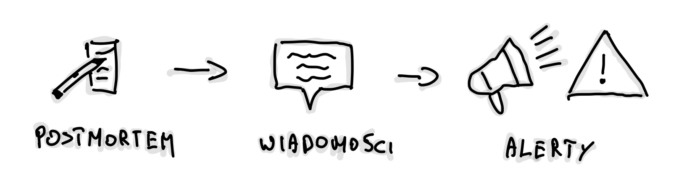
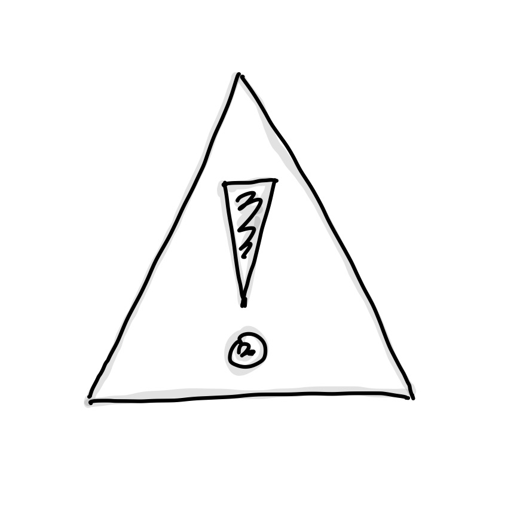

**_W poprzednim wpisie,
„_**[**_Biznesowe SLA w praktyce_**](https://rafalschmidt.com/biznesowe-sla-w-praktyce/)**_”,
opisałem cztery inicjatywy, które wdrożyliśmy w naszym zespole, aby poprawić
nasz produkt i dyżury. Dziś chciałbym zająć się tematem, który u nas świetnie
działa, a który być może nie każdy traktuje jako oczywisty krok – roli, jaką
pełni Weekly Service Review (WSR)._**

Zanim wejdziemy w szczegóły samego WSR-a, przejdźmy przez potencjalne pułapki,
jakie niesie ogólnie ze sobą spisywanie tego, jak pracujemy w zespole.

-   **Samo opisywanie procesów nie jest złe, ale...**

    Traktujmy spisywanie jako czas jak retrospektywę – jedna osoba przygotowuje
    materiał, a później zastanawiamy się wspólnie, co można ulepszyć. Tutaj jest
    jednak pewne ryzyko. Publikowanie tych zapisów _zbyt szeroko_ może prowadzić
    do porównań między zespołami, które nie mają pełnego kontekstu. To nie ma
    być konkurs piękności, kto ma "ładniejszy" proces – to ma wspierać nowych
    członków zespołu, żeby szybciej wdrożyli się w nasz sposób pracy.

-   **Unikajmy dogmatyzmu.**

    Formalizacja procesów niesie ze sobą jedno duże zagrożenie – skłonność do
    traktowania ich jako prawd objawionych. Spisanie tego, jak pracujemy, jest
    pomocne, ale tylko wtedy, kiedy rozumiemy, że to wskazówki, a nie zasady
    wyryte w kamieniu. Rzeczywistość zawsze będzie miała swoje wyjątki – urlopy,
    zmiany w zespole, nowe priorytety – i sztywne trzymanie się ustalonych
    procedur może zabić ducha zespołu.

-   **Koszt utrzymania procesów.**

    Udokumentowanie sposobu pracy to jedno, ale utrzymanie tego wymaga
    zaangażowania. Ktoś musi poświęcić czas na aktualizowanie, wprowadzanie
    poprawek i dostosowywanie procesu do bieżących realiów. To może być spory
    koszt.

W gruncie rzeczy, chodzi tu o balans – z jednej strony chcemy mieć porządek i
jasność co do tego, jak działamy, z drugiej, nie możemy zapominać o
elastyczności i kosztach utrzymania.

### **Weekly Service Review – jak ewoluowała nasza formuła**

Weekly Service Review (WSR) to ceremonia, które wdrożyliśmy jako odpowiedź na
rosnącą potrzebę lepszego zrozumienia incydentów i stabilności naszych usług.
Pomysł narodził się dzięki inspiracji podejściem
[Google do SRE](https://sre.google/sre-book/table-of-contents/), a początkowy
format był prosty – ot, dokument w Google Docs, trzy akapity, i wyznaczona
osoba, która zbierała informacje przez tydzień. Brzmi skromnie? Bo tak było.

<!-- markdownlint-disable -->

<!-- markdownlint-restore -->

W tamtym czasie zmagaliśmy się z dużą liczbą incydentów, głównie związanych z
naszym partnerem zewnętrznym. Robienie pełnego postmortem po każdym problemie
nie miało sensu, więc postawiliśmy na regularne przeglądy, aby zebrać
najważniejsze informacje i wyciągnąć wnioski. Omawialiśmy m.in.:

-   przyczyny problemów (np. spike związany z X),

-   odpowiedzialność (kto z zespołu był ownerem),

-   wpływ na użytkowników,

-   oraz działania naprawcze (dodanie nowych czujek, poprawa polityki retry,
    zwiększenie liczby podów, wyjaśnienie problemu z Y).

Obok tego, analizowaliśmy również kanał “**help**”, gdzie zbieraliśmy
powtarzające się pytania do naszego zespołu. Często proste zmiany w narzędziach,
jak dodanie nowej funkcjonalności do panelu administracyjnego, mogły rozwiązać
problem. A czasami rozwiązania były wręcz absurdalne – "reset pomógł". Naszym
celem było jednak zrozumienie, _dlaczego pytania wciąż się pojawiają_ i jak
ograniczyć ich liczbę w przyszłości.

Trzeci element? **Alerty**. Omawialiśmy większość, analizując przyczyny i
decydując, co z nimi zrobić. Może można to jeszcze zostawić na później, czy ktoś
musi się tym zająć od razu? Czasem alerty były wynikiem metryki typu „unexpected
rejection reason”, a czasem problem pojawiał się na poziomie SLI endpointu. W
każdym przypadku skupialiśmy się na wyciąganiu wniosków, by lepiej zarządzać
incydentami na produkcji.

Największą zaletą tego podejścia była liczba wygenerowanych pomysł. Zamiast
podejmować decyzje, **co robić**, skupialiśmy się na tym, **czego nie robić**.
Dzięki temu lider zespołu miał ułatwione zadanie – wspierać wybieranie, które
pomysły odrzucić.

### **Wprowadzenie struktury**

Z czasem iterowaliśmy. Wprowadzenie rotacyjnej roli prowadzącego WSR wprowadziło
różnorodność – każdy miał inny styl, a każda edycja wnosiła coś nowego.
Początkowo zbieraliśmy informacje ręcznie, potem eksperymentowaliśmy z workflow
na Slacku i Google Spreadsheet. Kiedy przyszła moja kolej na prowadzenie,
zauważyłem, że potrzebujemy nieco więcej struktury i automatyzacji. Dlatego
wprowadziłem kilka zmian.

Rozdzieliłem odpowiedzialność za zbieranie tematów od ich prezentacji, a sekcje
WSR zyskały bardziej uporządkowany format:

-   **Nowości**: Przestrzeń na wymianę informacji o nowych dashboardach,
    procesach, automatyzacjach czy innych zmianach, które wpływały na pracę
    zespołu. To nie było demo, ale miejsce na szybkie pytania, krytykę czy
    pochwały – wszystko, by zadbać o _well-being inżynierski_.

-   **Alerty**:
    <!-- markdownlint-disable -->

    
    <!-- markdownlint-restore -->

    Powtórzyliśmy format z pierwszej wersji, ale bardziej szczegółowo
    omawialiśmy powody alertów, analizowaliśmy metryki i decydowaliśmy, czy coś
    wymaga natychmiastowej reakcji.

-   **On-call handover**: Przechodziliśmy przez dyżury i analizowaliśmy, jakie
    problemy zostały nie zaopiekowane. Przyznawaliśmy oceny dyżurom w skali 1-5
    (od „rzeźni” po „nudę”). W tej sekcji widać było nasz postęp – z czego
    narzekaliśmy kiedyś, a z czym radzimy sobie dziś.

-   **Postmortemy**:

    <!-- markdownlint-disable -->

    

    <!-- markdownlint-restore -->

    Wprowadziliśmy tzw.
    "[Amazon 6-Pager](https://www.linkedin.com/pulse/beauty-amazons-6-pager-brad-porter/)"
    – każdy w ciszy czytał i komentował, a potem wspólnie omawialiśmy problemy.
    To była jedna z moich ulubionych zmian– dużo mięsa, dużo skupienia.

-   **Priorytetyzacja zadań oznaczonych tagiem WSR:** dbaliśmy o to, by problemy
    techniczne z backlogu były rozwiązywane lub odrzucane, jeśli straciły na
    ważności. Jednak ta sekcja z czasem również przestała działać tak dobrze,
    jak byśmy chcieli.

-   **Feedback**: Mieliśmy zaplanowane automatyczne wiadomości do zespołów, by
    zebrać ich opinie. Niestety, ta inicjatywa nie przynosiła oczekiwanych
    rezultatów, bo trudno było zebrać realny feedback.

Zaczęliśmy również monitorować **koszty infrastruktury** w Azure, a szczególnie
ich przeliczanie na „transakcje” czy „procesy”, żeby zobaczyć, jak nasze systemy
zareagują na wzrost skali. Ta metryka stała się bardziej wartościowa niż
standardowe, miesięczne raporty kosztów.

### **Format na szersze grono**

W miarę jak nasz zespół rozwijał się, a rola samego spotkania rosła, format WSR
ewoluował, stając się bardziej dostosowanym do szerszego grona odbiorców. Dziś
spotkania są bardziej ustrukturyzowane, z jasno określoną rolą prowadzącego, a
każda osoba ma możliwość dodawania tematów, które uważa za ważne. Inżynierowie
omawiają dostępność i stabilność usług oraz szukają sposobów na ich poprawę.
Ceremonia obejmuje sekcje takie jak:

-   **Planowane niedostępności vendorów/partnerów** - przeglądamy nadchodzące
    zmiany w usługach naszych partnerów.
    <!-- markdownlint-disable -->

    
    <!-- markdownlint-restore -->

    -   Odpowiadamy na trzy pytania:
        -   Czy powinniśmy wyciszyć niektóre alerty?
        -   Czy powinniśmy wyłączyć niektóre części produktu (procesy)?
        -   Czy powinniśmy wyświetlić baner informujący klientów o
            niedostępności?

*   Omawiamy też wydarzenia z poprzedniego tygodnia i analizujemy, czy nasze
    działania były trafione, a metryki zachowały się zgodnie z oczekiwaniami.

-   **Incydenty i postmortemy** – omówione wyżej.

-   **Nowości v2** – zbieramy tematy z kanałów Slack oznaczonych emotką
    „wsr-topic”, co ułatwia szybką identyfikację ważnych zmian. Przykłady to:
    <!-- markdownlint-disable -->

    
    <!-- markdownlint-restore -->

    -   nowe lub usunięte alerty,
    -   nowe metryki w Grafanie,
    -   usprawnienia w zarządzaniu incydentami,
    -   nowa dokumentacja,
    -   nowe procesy wpływające na stabilność lub doświadczenia on-call.

-   **Opcjonalne sekcje** - Dodatkowo mamy kilka opcjonalnych sekcji, które
    poruszamy, jeśli jest taka potrzeba:

*   **Koszty**: omówione wyżej.

*   **Metryki inżynierskie**: Raz na kwartał analizujemy nasze metryki
    inżynierskie, badając takie wskaźniki jak:

    -   czas cyklu PR, wielkość PR, wielkość zadań,
    -   wskaźniki DORA (częstotliwość wdrożeń, czas realizacji, średni czas
        naprawy, wskaźnik zmian).

Ten format pozwala nam również zapraszać liderów technicznych z innych zespołów
oraz PSE i dzielić się naszymi doświadczeniami. Wierzymy, że transparentność i
dzielenie się wiedzą to klucz do budowania lepszych, stabilniejszych usług.

---

Mam nadzieję, że nasza podróż przez ewolucję WSR zainspirowała Cię do
przemyślenia, jak ten proces mógłby funkcjonować w Twoim zespole. Niezależnie od
tego, czy dopiero zaczynasz, czy masz już zaawansowane procesy, kluczowe jest
jedno – elastyczność, stała wymiana wiedzy i otwartość na zmiany. To właśnie
dzięki takiemu podeściu WSR stał się dla nas narzędziem nie tylko do poprawy
stabilności usług, ale także do budowania lepszego zespołu.
